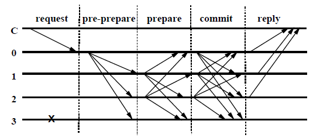
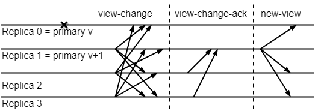
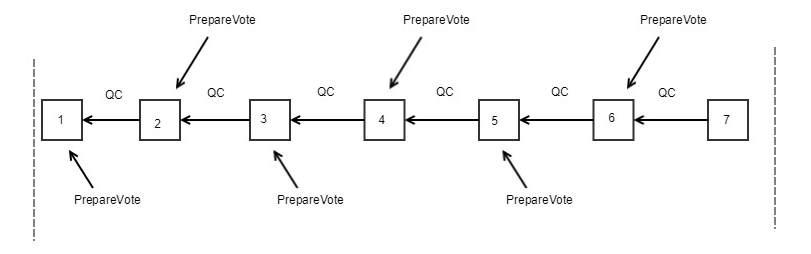
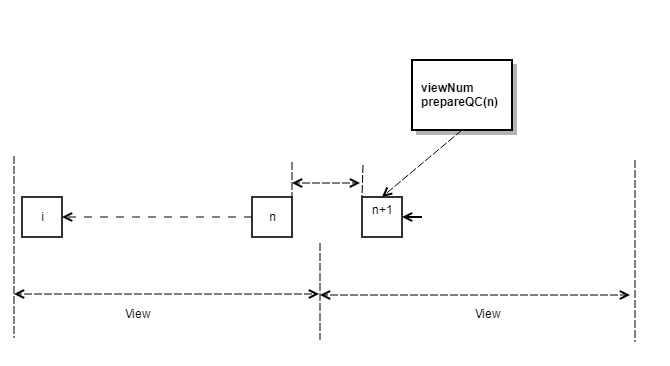
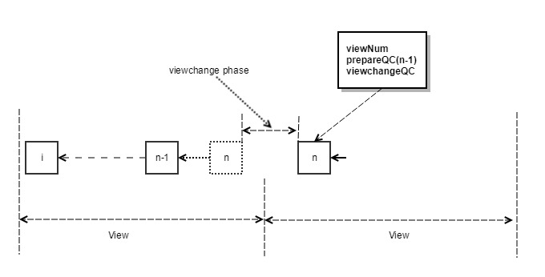
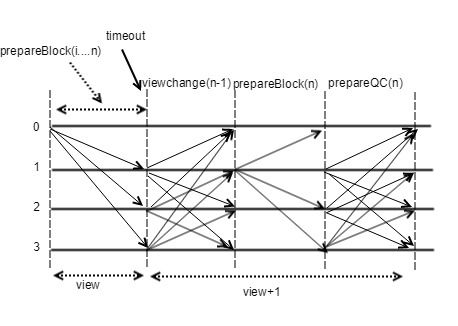
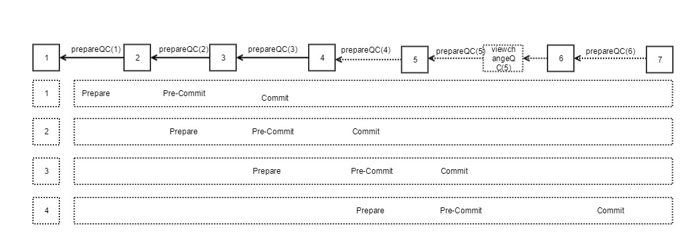

## Overview

We propose a parallel Byzantine fault tolerance protocol CBFT (Concurrent Byzantine Fault Tolerance) based on the assumption of partial synchronization to solve the problem of blockchain consensus efficiency. This article analyzes consensus protocols such as PBFT, Tendermint, Hotstuff, etc. CBFT combines its advantages, and completes the parallel generation and confirmation of blocks through the pipeline. Multiple blocks can be generated in a view window, and can be generated in O(n^(2)) complete the view window switching within, thereby improving consensus efficiency.

## Distributed network model

According to the theory of distributed systems, the network models of distributed systems are divided into three categories:

- Synchronous network model: The message sent by the node will definitely reach the target node within a certain time

- Asynchronous network model: The message sent by the node cannot be sure to reach the target node

- Partial synchronous network model: The message sent by the node, although there will be a delay, will eventually reach the target node

The synchronous network model is a very ideal situation, and the asynchronous network model is closer to the actual model, but according to the principle of **FLP is impossible [1]**, under the assumption of the asynchronous network model, the consensus algorithm cannot simultaneously satisfy the **safety** and **liveness**, most current BFT consensus algorithms are based on the assumption of a partially synchronous network model. We also discuss based on the assumption of a partially synchronous network model.

## BFT consensus protocol

### Overview

A distributed system is composed of multiple nodes, and the nodes need to send messages to communicate with each other, and according to the protocol they follow, consensus is reached on a certain task message and executed consistently. There are many types of errors in this process, but they can basically be divided into two categories.

- The first type of error is node crash, network failure, packet loss, etc. This type of error node is not malicious and belongs to non-Byzantine error.

- The second type of error is that the node may be malicious and does not follow the protocol rules. For example, the verifier node can delay or reject messages in the network, the leader can propose invalid blocks, or the node can send different messages to different peers. In the worst case, malicious nodes may cooperate with each other. These are called Byzantine errors.

Considering these two errors, we want the system to always be able to maintain two properties: safety and liveness.

- safety：When the above two types of errors occur, the consensus system cannot produce wrong results. In the semantics of blockchain, it means that there will be no double costs and forks.
- liveness：The system has been able to continuously generate submissions. Under the semantics of the blockchain, it means that consensus will continue to continue and will not get stuck. If the consensus of a blockchain system is stuck at a certain height, then the new transaction is not responding, that is, it does not meet the liveness.

BFT (Byzantine Fault Tolerance Protocol) is a protocol that can ensure the safety and liveness of distributed systems even if malicious nodes exist in the system. According to the classic paper of Lamport [2], all BFT protocols have a basic assumption: when the total number of nodes is greater than 3f, the maximum number of malicious nodes is f, and honest nodes can reach a correct result that is consistent.

### PBFT

The practical Byzantine fault tolerance algorithm (PBFT [3]) is one of the first Byzantine fault tolerance protocols in the real world to be able to handle both the first and second types of errors at the same time. Based on the partial synchronization model, it solves the problem of low efficiency of previous BFT algorithms. The complexity of the algorithm is reduced from the exponential level of the number of nodes to the square level of the number of nodes, making the Byzantine fault tolerance algorithm feasible in practical system applications.

The BFT consensus protocols used in the current blockchain can be considered as a variant of PBFT, which is in the same vein as PBFT.

#### Normal Process

The normal PBFT process is shown below (C is the client in Figure 1, the system has four nodes numbered 0 to 3, and node 3 is a Byzantine node):

Figure 1 PBFT normal process

The normal PBFT process is a three-phase protocol:
- pre-prepare: The primary node (Primary) broadcasts a Preprepare message to each replica node (Replica)
- prepare：At this stage, each node tells other nodes that I already know this message. Once a node receives n-f prepare messages (we will use the QC or Quorum Certificate to refer to the same), it enters the prepared state.
- commit：In this phase, each node and other nodes know this message. Once a node receives n-f commit messages (QC), it enters the committed state.

#### View switching process

Viewchange is the most critical design of PBFT. When the master node hangs (no response after timeout) or the replica node collectively thinks that the master node is a problem node, the ViewChange event is triggered and the viewchange phase begins. At this time, the nodes in the system will broadcast the view switching request. When a node receives enough view switching requests, it will send a view switching confirmation to the new master node. When the new master node receives enough view switching confirmations to start the next view, each view switching request must include a message that the node has reached the prepared state sequence number.

During the view switching process, we need to ensure that the sequence number of the submitted message is also consistent throughout the view change. In simple terms, when a message is sequenced n and 2f + 1 prepare messages are received, it will still be assigned the sequence number n in the next view and restart the normal process.

Figure 2 PBFT view switching process

As shown in Figure 2, viewchange will have three phases, namely the view-change, view-change-ack and new-view phases. When the slave node thinks that the master node has a problem, it will send a view-change message to other nodes. The node with the lowest number of the currently alive node will become the new master node. When the new master node receives 2f view-change messages from other nodes, it proves that there are enough people that the node thinks there is a problem with the master node, and it will broadcast to other nodes.

#### Communication complexity issues

PBFT is an agreement based on a three-phase voting process. In the prepare and commit phases, each node needs to broadcast its own prepare or commit message, so the communication complexity is $O(n^2)$.

During the view change process, all replica nodes are required to time out first, and then a consensus is reached on view change. Then, they inform the new master node of this consensus (and the consensus has been reached), and the new master The node also broadcasts this message to announce the view change, so the communication complexity of the view change is $O(n^3)$.

The communication complexity of up to $O(n^3)$ undoubtedly has a serious impact on the consensus efficiency of PBFT, which greatly limits the scalability of PBFT.

### Optimization of BFT protocol

How to reduce the communication complexity of $O(n^3)$ to $O(n)$ and improve the efficiency of consensus is the challenge that the BFT consensus protocol faces in the blockchain scenario. There are several types of optimization methods for BFT consensus efficiency:

#### Aggregate signature

E. Kokoris-Kogias et al. Proposed a method of using aggregate signatures in the consensus mechanism in their paper. The ** ByzCoin ** [4] mentioned in the paper replaced the original MAC used by PBFT with a digital signature to reduce the communication delay from $O(n^2)$ to $O(n)$. Using the aggregate signature method can The communication complexity is further reduced to $O(logn)$. But ByzCoin still has limitations in terms of master node evil or 33% fault tolerance.

After that, some public chain projects, such as **Zilliqa** [5], etc., based on this idea, adopted the EC-Schnorr multi-sign algorithm to improve the efficiency of message passing during the Prepare and Commit stages in the PBFT process.

#### Communication mechanism optimization

PBFT uses an all-to-all message mode, and therefore requires a communication complexity of $O(n^2)$.

SBFT (Scale optimized PBFT) [6] proposed a linear communication mode using a collector. In this mode, the message is no longer sent to each replica node, but to the collector, and then broadcasted to all replica nodes by the collector, and the message length can be reduced from linear to Constant, which reduces the total overhead to $O(n^2)$.

Tendermint [7] uses the gossip communication mechanism, which can reduce the communication complexity to $O(nlogn)$ under optimistic conditions.

#### view-change process optimization

All BFT protocols change the master node through view-change. Protocols such as PBFT and SBFT have independent view-change processes, which are triggered only when there is a problem with the master node. In Tendermint, HostStuff [8] and other protocols, there is no explicit view-change process. The view-change process is integrated into the normal process, so the efficiency of view-change is improved, and the communication complexity of view-change is reduced.

Tendermint integrates roundchange (similar to viewchange) into the normal process, so roundchange is the same as the normal block message commit process. There is no separate viewchange process like PBFT, so the communication complexity is reduced to $O(n^2)$.

HotStuff refers to Tendermint and also merges the view switching process with the normal process, that is, there is no longer a separate view switching process. By introducing a two-stage voting lock block, and using a leader node set BLS aggregate signature, the communication complexity of view switching is reduced to $O(n)$。

#### Chain BFT

Traditional BFT requires two rounds of consensus for each block. The communication complexity of $O(n)$ can make the block reach prepareQC, but the communication complexity of $O(n^2)$ is required for the block to reach commitQC.

Hotstuff changed the two rounds of synchronous BFT of traditional BFT to three rounds of chained BFT. There is no clear prepare and commit consensus phase. Each block only needs one round of QC. The prepare phase of the latter block is the previous one. The pre-commit phase of the block. The pre-commit phase of the next block is the commit phase of the previous block. Each time the block is generated, only the communication complexity of $O(n)$ is needed. Through the two rounds of communication complexity of $O(n)$, the effect of the previous $O(n^2)$ is achieved.

#### Pipelining and Concurrency

Protocols such as PBFT and Tendermint have the characteristics of Instant Finality, and it is almost impossible to fork. In PBFT, each block can be confirmed before the next block can be issued. Tendermint also proposes the concept of block locking to further ensure the instant certainty of the block, that is, in a certain round stage, the node voted for the block message pre-commit votes, then in the next round, the node can only vote for pre-commit votes for this block message, unless it receives a new proposer's unlocking proof for a certain block message.

This type of BFT consensus protocol is essentially a synchronous system that tightly couples the production and confirmation of blocks. After a block is confirmed, the next block can be produced. It is necessary to wait for the largest possible network delay between blocks, and the efficiency of consensus Great limitation.

HotStuff's Pipelining method separates the production and confirmation of blocks. The final confirmation of each block requires the latter two blocks to reach QC, which means that the previous block is not fully confirmed (three-chain needs to be met) Can produce the next block. This method is actually a semi-synchronous system, and the generation of each block still needs to wait for the previous block to reach QC.

EOS [9] 's BFT-DPoS consensus protocol can be considered as a completely parallel Pipelining solution: each block is broadcast immediately after production on the entire network, and block producers wait for 0.5 seconds to produce the next block while receiving other witnesses People use the BFT protocol to reach a consensus on the confirmation result of the previous block. The production of the new block and the receipt of the old block are performed simultaneously, which greatly optimizes the block production efficiency.

## CBFT consensus agreement

### Why design CBFT

In the previous content, we analyzed the problems of the BFT consensus protocol and several mainstream optimized BFT consensus protocols. These BFT consensus protocols have achieved good research results in reducing communication complexity and block production efficiency, but there are still some Room for improvement.

- Although PBFT is more practical than the previous BFT algorithm, it is subject to O(n^(3)) view switching overhead, which has a large problem in scalability.

- Tendermint merges round change with normal processes, simplifies view switching logic, and reduces the communication complexity of view switching to $O(n^2)$, but needs to wait for a relatively large network delay to ensure activity. At the same time, Tendermint is still serially issuing and confirming blocks. Voting for a block needs to wait for the completion of the commit of the previous block to start.

- In EOS's BFT-DPOS consensus protocol, block producers can continuously generate several blocks, and at the same time, the blocks are confirmed in parallel, which increases the block production speed. Blocks are confirmed using the BFT protocol, but only applicable to strongly synchronized communication models.

- HotStuff innovatively proposed a three-phase submission BFT consensus protocol based on the leader node, absorbing the advantages of Tendermint, merging viewchange with normal processes, and reducing the communication complexity of viewchange to linear. At the same time, by simplifying the message type, the block can be confirmed in a pipeline manner. However, the introduction of a new voting stage will also increase the communication complexity. At the same time, a view window only confirms one block. This undoubtedly requires more communication complexity in view switching. In addition, the star topology based on the collection of votes by Leader nodes is more suitable for a good alliance chain such as Libra. In a weak network environment, it is more likely to be affected by a single point of failure, resulting in a large leader node switching overhead.

Therefore, we propose the CBFT consensus protocol. Further optimization on the basis of the above consensus protocol can greatly reduce the complexity of communication and improve the efficiency of block production.

### CBFT overview

Based on the partially synchronous mesh communication model, CBFT proposes a three-phase consensus parallel Byzantine fault tolerance protocol. The mesh communication model is more suitable for the weak network environment of the public network. The protocol has been used as a consensus algorithm on PlatON.

The normal process of CBFT is similar to Hotstuff, and it is divided into prepare, pre-comit, commit, and decide stages. However, CBFT has also made a key improvement: multiple blocks can be proposed continuously in a view window, and the generation of the next block does not need to wait for the previous block to reach QC; and each node can receive the vote of the previous block at the same time , The transaction of the next block is executed in parallel, and the block is voted to confirm the block, which greatly improves the block production speed.

CBFT has a self-adaptive view switching mechanism: In a view window, when a node receives enough blocks and votes in favor (more than 2/3 of the nodes vote, that is, QC), it will automatically switch the window and switch to The next window does not require a viewchange vote. In addition, the node will start the viewchange process, and the same two-phase lock voting rules as Hotstuff are introduced during the viewchange phase. At the same time, the BLS aggregation signature is used, which can be completed within the communication complexity of $O(n^2)$ The view window switches.

According to the discussion above, CBFT only performs viewchange outside the normal process, so it will have less view switching overhead than HotStuff.

Next, the related concepts and meanings involved in the CBFT consensus will be given first, so that the CBFT will be introduced in detail later.

#### CBFT related terms

  * **Proposer：** Node responsible for generating blocks in the CBFT consensus
  * **T：** Time window, each proposer can only make blocks in his own time window
  * **N：** Total number of consensus nodes
  * **f：** Maximum number of Byzantine nodes
  * **Enough votes：** Expressed as receiving at least N-f votes
  * **Validator：** Non-proposer nodes in consensus nodes
  * **View：** The time range in which the current proposer's time window can generate blocks
  * **ViewNumber：** Sequence number of each time window, increasing with time window
  * **HighestQCBlock：** Local highest N-f PrepareVote block
  * **ProposalIndex：** Index number of the proposer
  * **ValidatorIndex：** Index number of the validator
  * **PrepareBlock：** Proposed block message, mainly including Block, the index number of the proposer
  * **PrepareVote：** Validators vote on Prepare for the proposed block, and each validator needs to execute the block before sending PrepareVote. Mainly include ViewNumber, block hash, block height, validator index number (ValidatorIndex)
  * **ViewChange：** When the time window expires and the proposer's blocks have not collected N-f PrepareVote, a ViewChange will be sent to the next proposer. ViewChange contains the proposer index number (ValidatorIndex), the highest confirmation block (HighestQCBlock)
  * **Lock：** Lock the specified block height
  * **Timeout：**  Timeout (the time window expires can be considered as the timeout for the proposer)
  * **legal：** Maximum allowed
  * **Same View：** The ViewNumbers of two Views are equal and can be the same View 

#### BLS signature

Currently, the aggregate signature scheme adopted by the industry is BLS aggregate signature. BLS aggregation signature is an extension scheme based on BLS signature scheme. The Boneh-Lynn-Shacham (BLS) signature scheme was proposed by Dan Boneh, Ben Lynn, Hovav Shacham [10] in 2001. BLS signatures are currently used in many blockchain projects such as Dfifinity, filecoin, and Libra. BLS aggregate signature can reduce multiple signatures into one aggregate signature, which is very important to improve the communication efficiency in BFT consensus protocol.

It is worth noting that the method of BLS aggregation signature is flawed. An attack called rogue public key can give the attacker the opportunity to manipulate the output of the aggregate signature after obtaining the public keys of other signers and standard BLS signature information.

One of the most direct defenses against this attack is that everyone participating in the BLS aggregate signature needs to first prove that they actually have the BLS private key information and register in advance. This process can be accomplished by using a simple and efficient zero-knowledge proof technology (Schnorr non-interactive zero-knowledge proof protocol). Participants need to give zero-knowledge proofs before they perform aggregate signatures, proving that they hold the public key information, and they do know the private key information corresponding to the public key.

### CBFT agreement process

#### Normal Process

Figure 3 CBFT normal process

1. After the proposer successfully enters the new View, it will generate multiple blocks in succession and broadcast the message PrepareBlock <ViewNumber, ProposalIndex, Block> to the validator.

2. Verify blocks one by one: The verifier verifies the signature and time window, executes the block, and generates PrepareVote <ViewNumber, BlockHash, BlockNumber> after success. When the parent block corresponding to PrepareVote collects N-f PrepareVote, the individual signatures of N-f PrepareVote are aggregated into one aggregate signature using BLS, and the current PrepareVote is broadcast. We simplify N-f PrepareVote to prepareQC (quorum certificate). 

3. When the node receives prepareQC in the last block in the current view, it will enter the new view and start the next round of voting.

In order to vote more securely, voting must comply with the following rules:
  - Vote after block execution

  - Honest nodes can only vote on the blocks proposed by the current View

  - Honest nodes cannot vote after the View times out, and they do not receive votes from the current View.

  - In the same View, two blocks of the same height can only vote for one of them.

  - When voting on Block (n + 1), Block (n) needs to reach prepareQC

#### ViewChange process

Figure 4 The switching window when the block is completed within the time window

Figure 5 The block is not completed within the time window but the window is switched when it expires
 

Figure 6 viewchange voting process
 
Assuming that each time window allows a maximum of n blocks, the viewchange process is as follows:

　1. If within the time window, the nth block prepareQC is received, the local view + 1 is updated to enter the new normal process. In this case, if the new proposer reaches the QC of n, the first block is broadcasted. As shown in Figure 4, the height is BlockNumber (n) +1, and will carry prepareQC for n blocks.
　2. If the time window expires, the node will first refuse to generate a new vote for the current proposer's block, and at the same time does not receive the prepareQC for the nth block, it will send a ViewChange <ViewNumber, HighestQCBlock> message, as shown in Figure 5.
　3. After the proposer of the next time window receives N-f ViewChange messages (we refer to N-f ViewChange messages as viewchangeQC), the BLS signature is used to aggregate into a QC signature, and then the local ViewNumber + 1 is updated, because the block is locked by two rounds of voting Rule, the new proposer can simply select HighestQCBlock from the N-f viewchange messages received, set the new block number to HighestQCBlock + 1, as shown in Figure 6, and then broadcast the first block to each validator Node and carry the QC signature of HighestQCBlock and the QC signature of viewchange.
 　4. Each validator node will start a new round of consensus based on the received HighestQCBlock + 1 sequence number.

#### Block confirmation

##### Pipelining process

In traditional BFT (PBFT, Tendermint), each block usually needs to go through a clear Pre-Commit and Commit phase before final confirmation:

- **Pre-Commit：** When a node receives N-f Prepare votes, it broadcasts Pre-Commit. Pre-Commit can be regarded as confirmation of the Prepare phase.
- **Commit：** When N-f Pre-Commit votes are received, it indicates that all nodes agree on the specified message and submit it to the local disk.

According to the introduction above, CBFT also has two phases, Prepare and ViewChange. Each block has only Prepare vote, and there is no clear Pre-Commit and Commit phase. So how to achieve block confirmation? CBFT can be regarded as Pipeline version of BFT. Each prepareQC is a higher-level confirmation of the previous block.

Figure 7 CBFT confirmation process

As shown in Figure 7, prepareQC (2) is used as the Pre-Commit stage of Block (1), prepareQC (3) is used as the Commit stage of Block (1), and Pre-Commit stage of Block (2).

Therefore, in CBFT, there are only two message types: prepare message and view-change message, and the QC of each message is verified by the aggregate signature.

##### Block reorganization

Assume that each view is allowed to generate n blocks. The current view $ V_i $ time window expires and the view switches to $ V_ {i + 1} $. At this time, only some blocks generated in $ V_i $ can get QC. Some blocks will be reorganized. The reorganization rules are as follows:

- Pre-Commit state blocks are locked and cannot be reorganized. That is, if the current node has a Pre-Commit state block at height h, the current node cannot generate new blocks at height h and cannot Block voting
- Prepared blocks can be reorganized, that is, if the current node has a Prepared block at height h, the current node can generate new blocks at height h, or vote for other blocks at height h (Only voting on blocks with higher viewnumber is allowed)

### Validator replacement mechanism

In the CBFT consensus, the validator set is updated every 250 blocks (called an Epoch). The update rules are as follows:

- New validators may not be able to participate in consensus due to reasons such as network connection or block synchronization, so we replace no more than 8 nodes at a time. If there are less than 8 candidate validators, the number of replacements is the total number of candidate validators.
- A new validator is randomly selected from the candidate validators using VRF.

### Fault Tolerance Recovery (WAL) mechanism

The CBFT consensus provides a fault-tolerant recovery mechanism, which is the WAL module. This module does not belong to the write-ahead log system in the strict sense, but draws on the relevant ideas, and in the process of validator consensus, the consensus state of the yet-to-be-blocked block and the current View consensus message are persisted from the memory to the local database and local files. After the system crashes or the machine is powered off and restarted, the consensus state is quickly restored through the disk log data.

Here is a brief introduction to the main principles:

- Block, viewChange The consensus between each validator needs to go through the stages of verification, voting, etc. Before a block finally falls off the chain, the consensus status and messages related to the block are recorded in memory. The node restart just needs to recover the memory data of this part of the unchained block, so the checkpoint recovery point is the currentBlock of the current blockchain. 
- Chain voting is available. The voting of each block is a confirmation of the previous block, reaching the Commit stage of the block when reaching the third level, so the prepareQC status of the 3-chain block is very important in the consensus. Must be restored after restart, this part of data is stored to db 
- The consensus message retains only the most recent view-related, this part of the data is stored to a file

### Block synchronization mechanism

Due to the asynchronous parallelism of the CBFT consensus, the latest blocks are stored in memory, and the block height has three types of heights: the highest logical block height, the highest confirmed block height, and the write block height. The height decreases in order. Therefore, the block synchronization mechanism in CBFT is also adapted based on the existing PlatON-P2P, and the method of obtaining the block height is adjusted. 
Here is an overview of the block synchronization mechanism:

- Newly added nodes are updated to the main network height via PlatON-P2P with fast synchronization or full synchronization
- Consensus nodes use the CBFT-P2P heartbeat mechanism to keep the block height consistent with other nodes
- When the block of the consensus node lags behind, it will actively reduce the amount of message traffic and go all out to handle block synchronization.
- Synchronization mechanism uses BLS signatures to reduce the amount of network synchronization messages

## CBFT analysis

### Basic rule definition

To facilitate the analysis of the safety and activity of CBFT, we define several basic rules of CBFT.

#### K-Chain rules

For a chain, the following conditions are met:
> B(0)<-C(0)<-...<-B(k-1)<-C(k-1)

We define it as K-Chain, where B is Block and C is B's prepareQC. We can see that when 3-Chain is reached, such as: `B0 <-C0 <-B1 <-C1 <-B2 <-C2`, B0 reaches the Commit state.

#### Lock-Block rules

In node a, when block n receives 2 prepareQCs after block n, block n is defined as Lock-Block (a). It can be observed that when Lock-Block (a) = B0, B0 reaches 2-Chain, such as `B0 <-C0 <-B1 <-C1`.

#### Unlock-Block rules

Assume that Lock-Block (a) is n. When n + 1 of sub-block n reaches prepareQC twice, Lock-Block (a) is n + 1. It can be observed that when Lock-Block (a) = B0, B0 reaches 2-Chain, such as B0 <-C0 <-B1 <-C1-B2, when B0 Unlock-Block, B0 reaches 3-Chain, such as ` B0 <-C0 <-B1 <-C1 <-B2 <-C2`.

#### Previous-Block rules

In the form of Block (B) <-prepareQC (B) <-Block (B '), we define Block (B) as the Previous-Block of Block (B'), which can be expressed as Previous-Block (B ') = Block (B).

From the Lock-Block and Previous-Block rules:

> In node a，E.g: B<-C<-B'<-C'<-B'' , Previous-Block(B'') > Lock-Block(a)

#### Commit rules

When block n receives 3 prepareQCs after block n, block n is Commit. It can be observed that when B0 is Commit, B0 reaches 3-Chain, such as B0 <-C0 <-B1 <-C1 <-B2 <-C2.

### Safety certification

**1）** There does not exist if there are two blocks of the same height in the same View can receive enough votes

**proof：** Assuming N = 3f + 1 is the total number of nodes and f is the maximum number of Byzantine nodes, then when 2f + 1 votes are received, there are enough votes. Because both blocks received at least 2f + 1, and the total number of votes was at least 2 (2f + 1) = N + f + 1, you can see that at least f + 1 has voted on two blocks, then f The Byzantine node hypothesis is contradictory.

**2）** For 3-Chain, B0 <-C0 <-B1 <-C1 <-B2 <-C2, ViewNumber (B2)> = ViewNumber (B0). Then Block (B) exists. When ViewNumber (B)> ViewNumber (B2), Previous_Block (B)> B0.

**proof：** For a normal honest node (voted for block B2, B), then the node can see at least B0 <-C0 <-B1 <-C1 <-B2, that is, the minimum Lock-Block is Lock-Block (B0 ). Because ViewNumber (B)> ViewNumber (B2), according to the ViewChange confirmation rule, the first block of ViewNumber (B) is not less than B1, then Previous_Block (B)> B0

**3）** Assume Lock-Block (n) of node n = B, Lock-Block (m) of node m = B ', and if Number (B) = Number (B'), then Hash (B) = Hash (B ')

**proof：** From the Lock-Block rule above, we know that there are two types of Lock-Block scenarios. In the first case, two QCs are in the same View, and it can be known from 1 that B 'and B do not receive enough votes at the same time. In the second case, B and B 'belong to different Views, and both receive prepareQC (B), prepareQC (B'). Assuming ViewNumber (B ')> ViewNumber (B), then according to conclusion 2, Previous_Block (B')> B, contradicts the assumption.

**4）** During the Commit phase, there will not be two Hashes of the same height and different blocks being Commited.

**proof：** It can be known from 3 that if Number (B) = Number (B '), there is no B and B' being locked at the same time. It can be inferred that there is no case where both Commit (B) and Commit (B ') are submitted.

### Proof of liveness

Assume that the maximum network delay between nodes is T and the execution block is S

**1）** Time without a time window that is always less than time (prepareQC) * 2

**proof：** Adjust the actual window size reasonably according to the actual network conditions to ensure that QC is reached at least 2 times in the time window, and the time window is at least 2 * S + 4 * T

**2）** ViewNumber can be agreed upon and incremented

**proof：** ViewChange needs at least T to reach agreement. Conclusion 1 can guarantee that ViewChange can reach agreement, so that ViewNumber can be incremented

**3）** Lock-Block height always increases

**proof：** Assuming ViewNumber is n, n + 1, security proof (2) can guarantee that the first block of ViewNumber (n + 1) Previous-Block is at least Lock-Block (View (n)). 1), as proof of living (1), so at least twice prepareQC, you can get the relationship between the lock height of two Views, Lock-Block(View(n+1)) >= Lock-Block(View(n))+1

### Communication complexity analysis

* PBFT: Mesh network topology, using a two-stage voting protocol, the message is locked when it reaches the prepared state, there is a separate view switching process, the communication complexity of the normal process is $ O (n ^ 2) $, and the communication complexity of the view switching process is $ O ( n ^ 3) $. 
* Tendermint: The mesh network topology uses a two-stage voting protocol. When the message reaches the prepared state, it is locked. The view switching process is merged with the normal process, and the communication complexity is $ O (n ^ 2) $. 
* Hotstuff: The star network topology adopts a three-phase voting protocol, the message is locked when it reaches the pre-commited state, the view switching process and the normal process are merged, and the communication complexity is $ O (n) $. 
* CBFT: The mesh network topology adopts a three-phase voting protocol, the message is locked when it reaches the pre-commited state, the self-adaptive view switching process, and the communication complexity is $ O (n ^ 2) $. 

## Review and summary

　This article discusses the current common BFT consensus algorithms, and proposes a CBFT protocol that can be more suitable for the public network environment. It can greatly improve the speed of block confirmation and satisfy the blockchain on the premise of meeting security and activity There is a growing need for consensus speed.

## references

[1] M. J. Fischer, N. A. Lynch, and M. S. Paterson, “Impossibility of distributed consensus with one faulty process,”*J. ACM*, 1985.

[2] L. Lamport, R. Shostak, and M. Pease. The Byzantine Generals Problem. ACM Transactions on Programming Languages and Systems, 4(3), 1982.

[3] M. Castro and B. Liskov. Practical byzantine fault tolerance. In OSDI,1999.

[4]  E. Kokoris-Kogias, P. Jovanovic, N. Gailly, I. Khoffi, L. Gasser, and B. Ford, “Enhancing Bitcoin Security and Performance with Strong Consistency via Collective Signing,” 2016.

[5]  TEAM T Z. Zilliqa TechnicalWhitepaper[J]. Zilliqa, 2017: 1–8.

[6] Guy Golan Gueta, Ittai Abraham, Shelly Grossman, Dahlia Malkhi, Benny Pinkas, Michael K. Reiter, Dragos-Adrian Seredinschi, Orr Tamir, Alin Tomescu，“a Scalable and Decentralized Trust Infrastructure”，2018.

[7]      C. Unchained, “Tendermint Explained — Bringing BFT-based PoS to the Public Blockchain Domain.” [Online]. Available: https://blog.cosmos.network/tendermint-explained-bringing-bft-based-pos-to-the-public-blockchain-domain-f22e274a0fdb.

[8] M. Yin, D. Malkhi, M. K. Reiterand, G. G. Gueta, and I. Abraham, “HotStuff: BFT consensus in the lens of blockchain,” 2019.

[9]      “EOS.IO Technical White Paper v2.” [Online]. Available: https://github.com/EOSIO/Documentation/blob/master/TechnicalWhitePaper.md.

[10] Dan Boneh, Manu Drijvers, Gregory Neven. "BLS Multi-Signatures With Public-Key Aggregation", 2018.