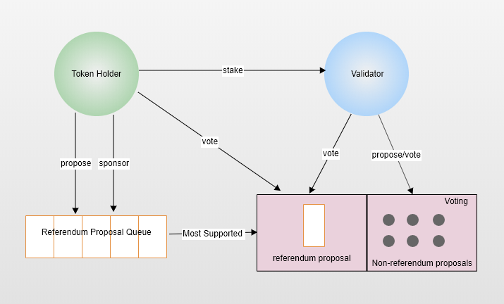
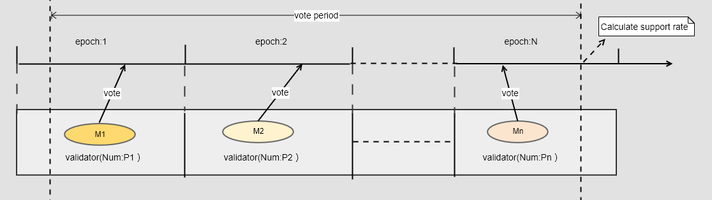
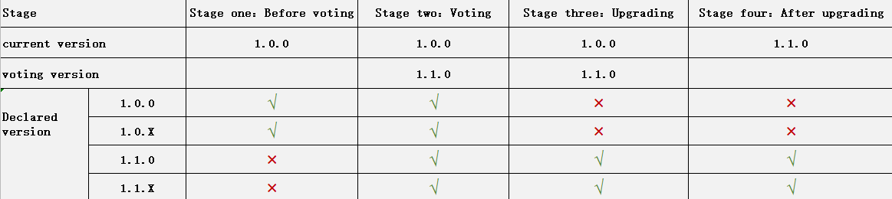

## Overview

Blockchain governance mechanism refers to a set of decision rules and action standards for stakeholders in the blockchain ecosystem to agree on decisions. Its purpose is to allow the decentralized network to continue to iteratively develop over time. In the blockchain, some important technologies, such as consensus mechanism, scalability, security, etc., can be better solved by providing reasonable incentives through the governance mechanism. A complete blockchain governance mechanism should be a combination of blockchain technology, economics, and political science, including rights distribution, economic incentives, and technological realization. The blockchain's ecological structure consists of developers, miners, and users. Each role in governance needs to play its own value, assume corresponding responsibilities, and obtain corresponding benefits. The significance of governance is to reduce the occurrence of community fragmentation and chaos, help the community to improve the efficiency of project update iteration, and increase the participation of community members. 

## Analysis of governance status

At present, governance is divided into off-chain governance and on-chain governance from the big model. Off-chain governance is controlled by core developers. Nodes issue decision signals by installing software and give full responsibility to those who run complete nodes. It has higher flexibility, but requires higher social coordination costs and lacks a reasonable incentive mechanism. , Restricting the entry of new developers. And on-chain management has a clear set of governance processes, which are forcibly upgraded through the on-chain proposal voting mechanism and hand over decision-making power to stakeholders.

The representative public chains of off-chain governance, such as Bitcoin and Ethereum, are mainly upgraded by the core developers, and ordinary miners and user groups lack the right to choose, so participation is low and the citizen base is weak. Recognizing the shortcomings of off-chain governance, some public chains have begun to launch their own on-chain governance mechanisms to digitize community decisions and greatly reduce the coordination costs of stakeholders. The common power distribution mode of on-chain governance mechanisms is often the choice and balance of direct democracy and indirect democracy.

Direct democracy involves the holders of money directly participating in the formulation of rules, using one coin per vote, and a higher degree of decentralization, such as Decred and Tezos. In direct democracy, there are often issues such as turnout, professionalism, and token concentration. Indirect democracy is the representative system. Representatives are elected through different methods and rely on the representatives to exercise their rights, such as the EOS super node, the board in Polkadot, and the "follow voting" mechanism in DFINITY. Indirect democracy needs to consider issues such as the design of governance structures, the allocation of power, and incentives.

## PlatON governance mechanism

In our opinion, decision-making power should belong to "stakeholders", that is, the right belongs to the people. However, the referendum needs to take into account issues such as implementation costs, turnout rates, professionalism, and governance efficiency. Therefore, the referendum should not be the governance norm, but also the governance method in the case of major differences. In our PPoS design, the generation of alternative nodes is an election in itself, and the interests of the nodes are closely related to the rise and fall of the public chain ecology. It should assume more governance responsibilities and have more governance rights. Therefore, in PlatON governance, we have adopted a combination of direct democracy and indirect democracy. Its core principle is: in the normal state, voting by alternative nodes, that is, indirect democracy; in the case of major differences, the community voted publicly, that is, direct democracy .

### Participation role

- **Alternative node**
  Nodes become candidates through pledge of certain tokens, other users can entrust their own tokens to candidates, and the system ranks according to the total rights and interests of the candidates (pledge + delegation). The top 101 candidates are elected as alternative nodes.
- **Energon Holder**
  All Energon token holders.

- **Core development** 
  Co-construct core developers of the PlatON public chain and community.

### Distribution of rights
- **Alternative node**
  - Initiate a proposal
  - Vote on the referendum proposal
  - Vote on non-referendum proposals
  - Follow the proposal
- **Energon Holder**
  - Initiate a proposal
  - Vote on the referendum proposal
  - Follow the proposal
- **Developer**
  - GitHub code control
  - Proposal review
  - Proposal realization

### Proposal classification

- **Referendum proposal**
  The referendum proposal takes place in a highly controversial scenario. Any currency holder can initiate a referendum proposal, which requires a referendum to produce results. The scenario is as follows:
  - Amend the Basic Law
  - Do a major fork, similar to The Dao's fork
  - Terminate the running of the chain
- **Non-referendum proposal**
  Non-referendum proposals are ordinary proposals that are produced by voting by alternative nodes. The types of proposals can be divided into the following types:       
  - Text proposal: can be initiated with text proposal for decisions that need not be implemented
  - Software upgrade proposal: used to initiate an upgrade vote on the chain to achieve the purpose of smooth upgrade
  - Parameter modification proposal: used to modify system parameters such as those that can be governed
  - Account proposal: used to freeze or unfreeze accounts (including contracts)
  - Incentive Proposal: Used to allocate the balance of the governance fund account
  - Cancel Proposal: Used to cancel a software upgrade proposal that is being voted on the chain

### Governance process

**1)** **Initiate a proposal**

Referendum proposals can be initiated by anyone, and non-referendum proposals are initiated by alternative nodes. Each proposal should have a corresponding text description, which is stored in the PIP repository on github and managed by the core developer, similar to EIP.

In order to control spam proposals, the initiation of all types of proposals requires a fee for the proposal as the cost of the proposal.

**2)** **Proposal screening**

 - **Referendum proposal**：Since referendum proposals are not the norm, multiple referendum proposals can be launched on the chain at the same time. These proposals will be sorted according to the highest deposit, and the proposal with the highest deposit will be selected each month to enter the voting stage.

 - **Non-referendum proposal**：Successfully launching a proposal will enter the voting period, and multiple proposals can be voted in parallel.

**3)** **Proposal voting**

 - **Referendum proposal**

   The core equity vote of the referendum proposal. Voting will last for two weeks and there are three voting options: "support", "oppose" and "abstain". Only tokens participating in staking and delegation can vote. The form of voting adopts the model of “alternative node vote + personal vote coverage”. That is: the voting weight of the candidate node is the sum of the amount of its own pledged tokens and the number of accepted commissioned tokens. If the client has a different opinion from the candidate node, the client can vote on its own. The voting options corresponding to the weights will be overwritten. All votes will be locked until the end of voting.

   In order to alleviate the problem of voting centralization caused by the majority of tokens being controlled by a few nodes, the number of candidate nodes participating in voting should be sufficient. If the majority of candidate nodes do not agree or do not participate in voting, the proposal will still not be passed.

- **Non-referendum proposal**

   The core of voting for non-referendum proposals is voting for alternative nodes. Any node that is elected as a candidate within the voting period of the proposal can vote. The voting cycle is generally two weeks, and the voting cycle of a software upgrade proposal can be determined by the proposal initiator according to the situation. The voting method adopts the one-person-one-vote system for alternative nodes. After voting, the alternative nodes will lock their own staking tokens until the voting ends. In addition to software upgrade proposals, there are three voting options for other types of voting: "Yes", "No", and "Abstain". In order to simplify the voting process, there are no obvious options for the **software upgrade proposal**. Each candidate node can indicate its voting position by whether to upgrade the local node. For details, please refer to[升级机制](#upgrade)。

**4)** **Calculation of voting results**

 - **Referendum proposal**： There are three dimensions for the calculation of the results of the referendum proposal:
   
   - Support rate of candidate nodes：Ratio of the number of candidate nodes supported by voting to the total number of candidate nodes that can vote
   - Token support rate：Ratio of the number of tokens supported to the total number of tokens participating in voting
   - Token participation Rate：Ratio of the total number of tokens participating in the voting to the total number of tokens staking
   
   When both: the support rate of the candidate nodes> P%, the token support rate> Q%, and the token participation rate> K%, the proposal is approved, otherwise the proposal is not approved.
   
 - **Non-referendum proposal**：There are two calculation dimensions for non-referendum proposals:
   
   - Support rate of alternative nodes：Ratio of the number of alternative nodes supported by voting to the total number of alternative nodes that can vote
- Alternative node participation rate：Ratio of the number of voting alternative nodes to the total number of voteable alternative nodes
  
   When both: the support rate of the candidate node is greater than M%, and the participation rate of the candidate node is greater than N%, the proposal is approved, otherwise the proposal is not approved.
   
   The support and participation rates for different types of proposals are as follows:
   
| Type | Participation Rate | Support ratio |
|:-------|:-------|:-------|
| Text proposal | >50% | >=66.7% |
| Cancel proposal | >50% | >=66.7% |
| Parameter proposal | >50% | >=66.7% |
| Upgrade proposal | =100% | >=66.7% |

### Upgrade mechanism

#### Overall mechanism

The upgrade mechanism is a guarantee that the network can continue to iteratively improve. For different situations that may occur during the operation of the blockchain system, we should provide targeted upgrade methods, mainly in the following four cases:
 - Optimized upgrade：This type of upgrade is a functional optimization of the current chain version. Each node can decide whether to upgrade according to the situation, whether or not the upgrade does not affect the consensus.
 - Voting upgrade：Upgrades in this category add new features or fixes that affect the consensus mechanism. This upgrade needs to initiate a software upgrade proposal on the chain, and decide whether to implement the upgrade based on the voting results, and complete the smooth upgrade without interrupting the network. The focus will be explained later.
 - Repair upgrade：When a node cannot participate in consensus normally due to a low version or an abnormal transaction, the candidate node can restore the participation in the network consensus by installing a new version of the software.
 - Snapshot upgrade：When the blockchain system encounters a major anomaly, which prevents the entire chain from producing blocks properly, a snapshot can be generated based on the previous normal network state, and then the network can be restored based on the snapshot.

Below we will focus on the **on-chain voting upgrade mechanism**.

#### On-chain voting upgrade

The upgrade package corresponding to the software upgrade proposal is provided by the developer. The upgrade package must be compatible with the current chain version. Alternative nodes can participate in voting after upgrading the local node.

##### Initiate Upgrade Proposal

An upgrade proposal can only be initiated by an alternative node. When it is initiated, a proposal fee higher than that of an ordinary transaction needs to be paid. The following parameters need to be provided in the parameters of the software upgrade proposal:
 - Upgrade destination version number. The version number consists of three digits, such as 1.2.0. The first two digits of the version number of the upgrade target must be greater than the first two digits of the current chain version number.
 - The ID of the file that github describes the upgrade information, that is, PIP-ID. The ID must be unique
 - Number of consensus rounds for voting on the upgrade proposal. This parameter will be used to calculate the voting cutoff block height, that is, the 230th block cutoff vote of the Nth consensus round starts at the current consensus round.

There can only be one software upgrade proposal in the chain, that is, when a software upgrade proposal or parameter proposal already exists on the chain, another software upgrade proposal cannot be initiated. If you encounter a special reason or emergency at this time and need to initiate a new software upgrade proposal immediately, you can initiate a cancellation proposal to cancel the software upgrade proposal.

> Cancel proposal description： Cancel a proposal only when there is an upgrade proposal that is being voted on the chain. The following parameters are required to cancel a proposed transaction.
> - Transaction hash of cancelled upgrade proposal
> - The ID of the file that github describes the upgrade information, that is, PIP-ID. The ID must be unique
> - Number of consensus rounds to cancel proposal voting. The vote cutoff block height calculated by this parameter cannot exceed the canceled upgrade proposal vote cutoff block height.

##### Upgrade Proposal Vote

After the software upgrade proposal is successfully launched, it enters the voting stage. Only alternative nodes can participate in voting, that is, the voting transaction can only be initiated by the node's pledged account. Before voting, the local node must be upgraded, and then votes are counted as one person, one vote.

We do not set voting options for "support", "oppose" and "abstain" in the voting transaction for software upgrade proposals, but express our position through node behaviors, as follows:
- supporter：After the local node version is updated to the version in the proposal upgrade, a vote on the upgrade proposal can be initiated;
- neutral party：You can choose to upgrade the node, but do not vote, and initiate a version statement transaction to declare that this node has been upgraded, so that you can participate in the consensus normally regardless of whether the proposal is passed;
- Opponent：There is no need to upgrade the local node and no voting is required.

The following parameters are required to upgrade the proposal voting transaction:
- Hash that initiated the proposal transaction
- The actual version number of the node. This version number needs to be the same as the upgrade destination version number in the poll in order to vote successfully
- Node signature. The signature is the signature of the node's private key to the node's version number
> Although the nodes have been upgraded during the voting period, the logic currently running is still the logic of the old version. Wait until the implementation is complete before switching to the new version of the logic.

##### Upgrade proposal voting result statistics

The voting result of the upgrade proposal is counted at the block deadline. If the voting situation in the voting cycle is as shown in the figure above:

- The total number of alternative nodes in the settlement cycle 1: $ P_1 $, the number of voting votes initiated by the alternative nodes is $ M_1 $

- The total number of alternative nodes in the settlement cycle 2: $ P_2 $, the number of upgrade voting initiated by the alternative node is $ M_2 $

- The total number of alternative nodes in the settlement period N: $ P_n $, the number of voting votes initiated by the alternative nodes is $ M_n $

The final support rate：$SR=\frac{100\%\times \sum_{i=1}^{n}M_i}{\sum_{i=1}^{n}P_i-P_1\cap P_2 \cap ... \cap P_n}$

If $SR \geq 66.7%$, the proposal vote can pass and enter the implementation phase.    

##### Upgrade proposal implementation

Due to the randomness of VRF selection of candidate nodes and in order not to affect consensus, we need to ensure that the verification nodes in a consensus round are all upgraded nodes when implementing the upgrade.

Therefore, when the proposal voting deadline is high, the proposal's approval rate reaches 66.7%, then the upgrade will be implemented in the first block of the next consensus round, and no non-upgraded nodes will no longer be selected to participate in the consensus. In the current settlement cycle, the eliminated non-upgraded nodes will just not be selected by VRF to participate in consensus, but still enjoy the pledged benefits of the current settlement cycle.

##### Version declaration

As there may be data incompatibility between different versions, in order to avoid consensus failure due to version issues, the node version on the chain should be controlled, so we introduced a version declaration. A node initiates a version statement to indicate that its node version is consistent with the target version number in the current chain version or software upgrade proposal vote, so that it can have the opportunity to participate in consensus before and after the upgrade.

Only candidate nodes and validating nodes can initiate version declarations. Newly added nodes need to be candidates before they can launch a version statement. The conditions for each stage version declaration are as follows:

When the node version and the on-chain version are inconsistent (the first two digits of the version number are different), the node will not be selected to participate in the consensus. In order to participate in consensus in the subsequent settlement cycle. When there is a software upgrade proposal being voted on the chain, a version statement consistent with the upgrade version can be initiated. The version statement does not represent a vote. After the upgrade proposal is voted through, a node that has the same version number as the upgrade destination is declared without voting Can participate in consensus normally.

##### Quick upgrade

Initiating an upgrade vote on the chain is a serious matter. In theory, there should be no possibility of revoking the proposal. All results should be submitted to the candidate node to vote. However, we only allow one software upgrade proposal to be voted on the chain. Therefore, when an emergency situation needs to be quickly upgraded, if there are unprocessed proposals on the chain, it will directly affect the emergency processing speed. From this we introduce the cancellation proposal, which is initiated by the candidate node. The voting cycle can be determined by itself, but it must be within the voting cycle of the cancelled proposal. By initiating the cancellation proposal and the quick response of each node, the software upgrade proposal that is being voted on can be canceled in a short time, thereby implementing the emergency plan quickly. Cancel a proposal only when there is an upgrade proposal that is being voted on the chain. Cancellation proposals must be implemented once they are launched, so we encourage the use of cancellation proposals only in emergencies.

The following parameters are required to cancel a proposed transaction:

- Transaction hash of cancelled upgrade proposal
- The ID of the file that github describes the upgrade information, that is, PIP-ID. The ID must be unique
- Number of consensus rounds to cancel proposal voting. The vote cutoff block height calculated by this parameter cannot exceed the canceled upgrade proposal vote cutoff block height.

### Governance parameters

Alternative nodes can modify some system parameters by initiating a parameter governance proposal. To avoid problems caused by the cross-implementation of parameter proposals and upgrade proposals, when there are voting upgrade proposals or parameter proposals on the chain, it is not allowed to initiate new parameter modification proposals.
The parameter proposal voting cycle is two weeks. As of now, the governance parameters we support are as follows:

- slashing module

| Key | description |range|
| ---|---|---|
| slashBlocksReward |	When the block generation rate is 0, the number of blocks rewarded by the reduced block |[0, 50000] blocks	|
| slashFractionDuplicateSign|Proportion of penalty node own staking when dual signing behavior was reported| (0,10000] ‱|
| duplicateSignReportReward|	Whistleblower reward ratio	| (0, 80] %	|
| maxEvidenceAge| Number of valid settlement cycles for evidence reported by dual signing |(0, Node staking return lock cycle）Epoch|

- block模块

| Key | description |range|
| ---|---|---|
| MaxBlockGasLimit|Block Max Gas|[4712388, 210000000] gas|

- staking模块

| Key | description |range|
| ---|---|---|
| stakeThreshold| The minimum number of staking tokens to become alternative node candidates |[100W,1000w] LAT|
| operatingThreshold	|Minimum number of tokens for each delegation and redemption by the client|	[10, 10000] LAT|
| unStakeFreezeDuration |Node staking return lock cycle	| (Evidence validity,112] Epoch	|
| maxValidators| Number of alternative nodes |[25, 201]	|

### Reward and punishment mechanism

When designing a governance mechanism, a good system is needed to encourage more interested and capable professionals to participate in governance, and at the same time punish malicious acts such as occupying network resources.

#### reward

- Proposal rewards: Proposal rewards are automatically issued to the proposal initiation account after the proposal is voted through
- Voting rewards: After voting, tokens need to be locked until the voting of a proposal ends. Therefore, the voting reward is proportional to the length of the voting lock, and will be distributed to each voting account at the end of voting
- Developer rewards: Developer rewards need to initiate proposals on the chain, and decide whether to issue rewards based on the results of voting
- Vulnerability reward: After confirming the existence of the vulnerability, a proposal must be launched on the chain, and the result of the vote will be used to decide whether to issue a reward

#### punishment

If the dishonest node achieves the upgrade by disguising the version, when the chain is successfully upgraded, the candidate node is selected to participate in the consensus, the block generation rate will be low because the block cannot be consensus, and the system will punish it. Can be directly disqualified from validating nodes.

### Governance Fund

The governance fund originates from the foundation. Each year, a fixed percentage of funds are transferred from the foundation's account to the governance account. The balance of the governance account is distributed through proposal voting, which can be used for incentives and salary distribution. After the proposal is voted through, it will be automatically issued through multiple signatures.
