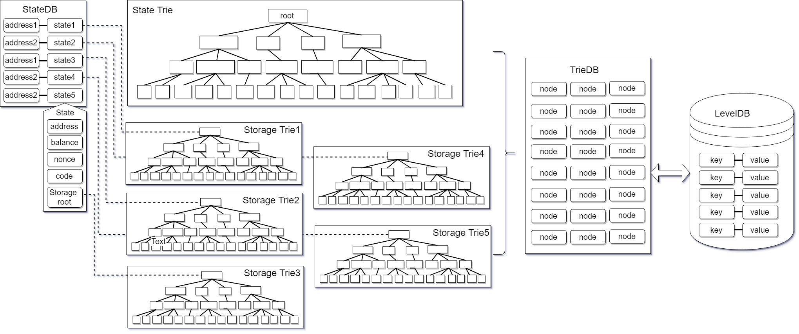
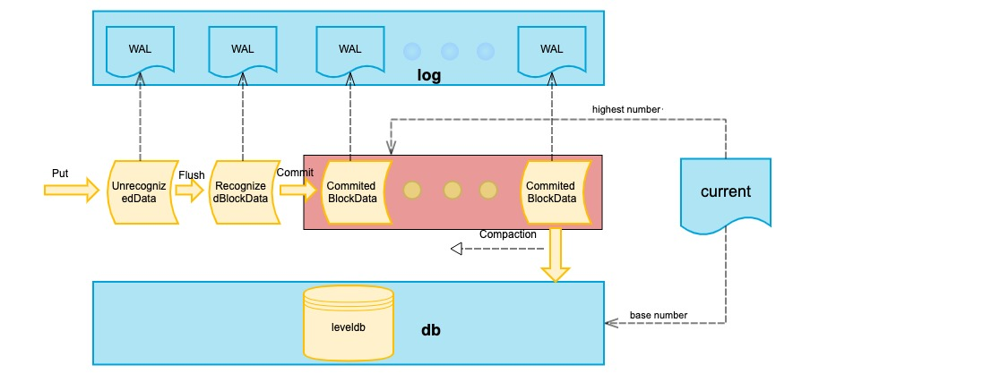
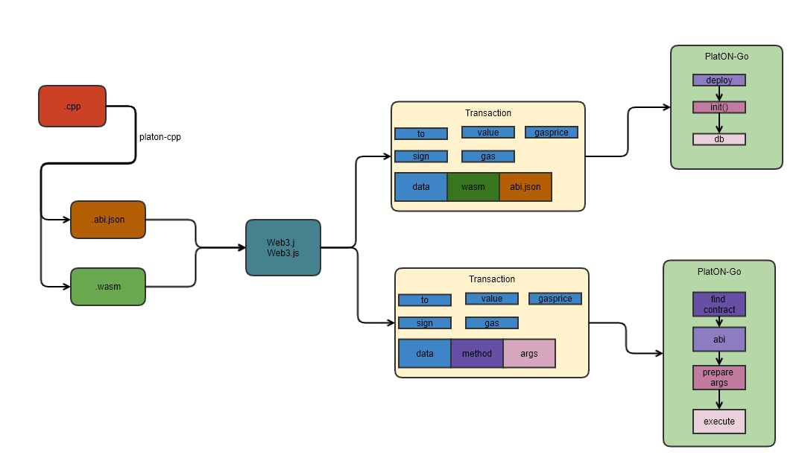

## Overview

 

### WEB3 Computing Infrastructure

 

With the rapid development of the Internet, Internet giants represented by FAANG and BAT have borrowed their monopoly status to store a large amount of user data, and based on this, they can use big data and AI computations to mine and enjoy the value of data. Users not only fail to obtain data dividends, but also bear the risk of personal privacy being violated and personal data being abused.

 

WEB3 is a serverless Internet and a decentralized network. In this Internet, users have full ownership of their own data, and no one or any organization can use other people's data without permission. But it also brings the following problems:

 

- Any single entity can always grasp only a part of the data set, and no arbitrary entity can get all the global data. Every participant of the digitalized world is partially blind, blocked in a certain angle towards the full picture.

- Participants are weakly trusted or even untrusted, and they cannot use “trusted third party” to collect the data and verify its validity to share value, information and assets. The emerging cloud computing platform is now a typical "trusted third party".

 

PlatON is committed to building the next generation of Privacy-Preserving Computing and data exchange networks in the WEB3 era. Based on modern cryptography and blockchain technology, PlatON creates a new computing paradigm to maintain privacy of the client’s data without the need to rely on third parties for collaborative computing and Verify the integrity of the results.

 

 

### Scalable Privacy-Preserving Computing

 

#### Blockchain: Consensus-based Strategy

 

 

In a broad sense, the existing blockchain architecture is a consensus-based strategy, which also implements a simple computation (smart contract) protocol: In order to ensure the correctness of the computation, each computation operation requires absolute The repeated processing of most nodes to verify the correctness of the computation has led to the inherent contradiction between efficiency and trust in the blockchain system.

From a practical point of view, the core of the industry is still concerned about two issues: scalability and privacy.

 

**Scalability** is a huge challenge for the blockchain. The current mainstream blockchain is not high in processing transactions per second, which is several orders of magnitude different from the processing power required to run mainstream financial markets. Although the industry is actively implementing various solutions, it is limited to the "impossible triangle", which is premised on sacrificing decentralization or security. Blockchain's consensus-based strategy method also limits smart contracts' ability to support complex computing logic.

 

**Privacy** is another major issue with blockchain. Although the blockchain's advantages such as immutability, decentralization, and no trust are tempting, it also faces the same dilemma of obtaining data as big data and AI technologies. Neither companies nor individuals have the willingness to share private information. Post to public ledgers, which can be freely read by governments, family, colleagues and business competitors without restriction.

 

#### PlatON: Non-interactive Proof Privacy-Preserving Computing

PlatON uses modern cryptographic algorithms including, but not limited to, Zero-Knowledge Proof (ZKP), Verifiable Computation (VC), Homomorphic Encryption (HE), Secure Multi-Party Computation (MPC), Secret Sharing (SS), etc. to implement non-interactive proof computation Expansion plan.

##### Scalability

 

The problems with the existing blockchain architecture stem from two very important parts: consensus and computation are too tightly coupled. PlatON proposes a verifiable computation solution that can fundamentally separate the two, divide and conquer these two problems, and weaken their endogenous binding relationship through mathematically provable cryptographic algorithms.

 

 

In view of the existing limitations of consensus on the chain, the function on the chain should be "verification" rather than "computation". Although on-chain has been recognized as an environment without trust, the implementation of off-chain solutions has introduced new factors of distrust. PlatON's Verifiable Computation (VC) cryptography algorithm passes trust off-chain. Through verifiable computation, the contract only needs to be calculated off-chain once, and all nodes can quickly verify the correctness of the computation, on the one hand, it improves the transaction processing performance, and on the other hand, it makes PlatON support Trustless computation of complex contracts.

 

##### Privacy

 
On PlatON, secure MPC and HE are combined to achieve complete privacy-preserving computing, ensuring the privacy of input data and the computation logic itself. Compared to trusted computing that relies on trusted hardware or TEE (such as SGX) provided by a third-party manufacturer for computational integrity, Trustless computing on PlatON relies only on falsifiable cryptographic assumptions, and thus during its life Provide unprecedented private data security without trust boundaries.

 

## PlatON Overall Architecture

 

### Overall logical structure

 

 

In addition to providing the underlying chain, PlatON also provides open source implementations of wallets, block browsers, and node tools:

 

- ATON Wallet: A mobile wallet that supports hot and cold HD wallets, transaction management and entrusted management. The account private key is managed on the client, and Keyshared (a key signature-based key management system) is subsequently supported.

- PlatScan Block Browser: The official block browser provided by PlatON

- Node tool

 

### Underlying logic structure

 

 

the Layer1 consensus network was modified on the technical framework of Ethereum, the core components were rewritten, and some new components were extended:

 

- Cryptographic algorithm: In addition to the SHA256Hash algorithm and ECDSA signature algorithm that have been used since the Bitcoin era, PlatON also uses BLS as the consensus signature of the consensus, VRF is randomly selected by PPoS verifiers, and ZKP and HE are privacy protection solutions.

- P2P network: PlatON does not use the libp2p and devp2p libraries commonly used in mainstream blockchain projects, implements the P2P protocol defined by the RFC standard RFC6940's RELOAD (REsource LOcation And Discovery), and the service discovery mechanism defined by the ReDiR (Recursive Distributed Rendezvous) of RFC7374

- Account model and data storage: Following Ethereum's account model, state data is stored in the Patricia tree. Due to the large amount of data, PPoS-related data is stored in the Patricia tree with poor performance. It is not stored in the Patricia tree, but is stored separately in another SNAPDB that does not store historical status.

- Consensus mechanism: use BFT-style PoS consensus mechanism. PPoS is a DPoS mechanism with VRF. The randomness introduced by VRF can endogenously suppress the expansion of the mining pool, which is very important for PlatON's decentralization and security. In addition, PlatON's BFT is a parallel Byzantine protocol CBFT (Concurrent Byzantine Fault Tolerance) based on the assumption of partial synchronization. CBFT refers to consensus protocols such as PBFT, Tendermint, Hotstaff, etc., and uses a pipeline to complete the generation and confirmation of batch blocks in parallel. To improve consensus efficiency.

- Smart contract: Support EVM and WASM engines at the same time, automatically select the corresponding virtual machine execution contract according to the specific transaction, and support mainstream programming languages ​​such as Solidity, C ++, Java, Python Implement the WASM compiler based on LLVM, and modify the corresponding command line IDE and graphical IDE based on Truffer, and support both privacy contracts and verifiable contracts.

- DAPP SDK: Based on Ethereum's WEB3 (supports Javascript, Java, Python, Swift languages) and JSON RPC, it is modified according to the function of PlatON. In addition, a more efficient GRPC interface needs to be added.

 

Layer2 extends complex computing to off-chain and implements Privacy-Preserving Computing protocols through off-chain Secure Multi-Party Computation.

 

- Cryptographic algorithm: Verifiable Computation (VC) algorithm can implement non-interactive proof of off-chain computing capacity expansion scheme. Secure Multi-Party Computation (MPC) combines secret sharing (SS) and homomorphic encryption (HE) to implement a privacy computing protocol.

- MPC virtual machine: The privacy contract is compiled into LLVM IR by the LLVM compiler. The MPC VM is implemented based on the LLVM JIT and can execute LLVM IR code. The MPC VM has built-in privacy computing protocols such as MPC, SS, and HE to reduce the LLVM IR after the privacy contract is compiled. Code size.

- Dedicated computing hardware: By developing dedicated computing hardware based on FPGA / ASIC, it can greatly improve computing performance and reduce power consumption / cost.

- Privacy computing and data exchange protocol: A computing protocol that enables collaborative computing and results verification without revealing the original data.

- Privacy-Preserving Computing Framework: A development framework that encapsulates Privacy-Preserving Computing and data exchange protocols, including a privacy AI development framework based on a Privacy-Preserving Computing protocol.

 

### Network Structure

 

 

#### Basic Network

 

PlatON's basic blockchain network is mainly composed of the following types of nodes, which are connected by P2P:

 

- Light Node

 

  It does not save the data of all blocks, only the block header information and data related to itself, and rely on full nodes for fast transaction verification. Light nodes participate in network-wide broadcasts of transactions and block information.

 

- Full node

 

  The data of all blocks are saved, and the validity of transaction data can be verified directly locally. Full nodes participate in network-wide broadcasts of transactions and block information.

 

- Archive node

 

  A node that saves the historical state of all blocks. The world state corresponding to any block in history is stored on the node. The archive node is a special full node.

 

- Seed nodes

 

  The new node joins the PlatON network and first connects to the seed node and discovers other nodes.

 

- Verification node

 

  Responsible for executing transactions and packaging transaction data into blocks, verification nodes are randomly selected through PPoS + VRF, and run the CBFT protocol for consensus.

 

#### Distributed Application

 

To deploy DAPP applications (including blockchain), the following servers need to be deployed in the intranet environment:

 

- Full node

 

  Used to access the PlatON network. All nodes can open public network P2P ports, but it is not recommended to open the RPC ports of the nodes.

 

- DAPP server

 

  Connect to the local full-node RPC port, monitor transactions, events, and blocks on the chain through the full node, and transactions occur. At the same time, the DAPP server is also connected to the original business system of the enterprise.

 

#### Verification node pool

 

The verification node pool deploys multiple verification nodes, and it is recommended to connect to the external network through a public full node. For specific security deployment methods, see [Join the Public Network](/en-us/Network/[English]-MainNet-and-TestNet.md).

#### Monitoring operation and maintenance platform

 

The monitoring operation and maintenance platform synchronizes all blocks, transactions, and events through a full node and monitors indicators.

 

#### PlatScan Block Browser

 

The PlatScan block browser synchronizes all blocks, transactions, and events through a full node, and displays data such as blocks and transactions. The PlatScan block browser requires the following servers to be deployed:

 

- Full node: RPC port is only open to internal data processing server

- Data processing server

- Database server

- WEB server

- Push server

 

#### ATON wallet server

 

ATON is a mobile wallet. The private key is managed on the client. The client is responsible for signing transfer transactions, pledge transactions, etc., and forwarding it to the chain through the ATON server. Sending transaction receipts, receiving transactions, validator information, and revenue on the chain are synchronized by the ATON server through the full node and pushed to the mobile client. ATON needs to deploy the following servers:

 

- Full node: RPC port is only open to internal data processing server

- Data processing server

- Database server

- WEB server

- Push server

 

### Verification node deployment structure

 

 

In order to protect the normal communication and operation of the verification node and the stable production of blocks, the node needs to be protected by security:

 

- RPC ports of full node and validator are closed.

- The verification node is not exposed on the public network and communicates through non-consensus full nodes.

- Each verification node should have at least 2 full public nodes and 2 non-public full nodes. The IP of the public full nodes can be made public for normal communication with the main network. The IPs of the other two non-public full nodes are only notified to other reliable verification nodes and are not made public to avoid simultaneous DDoS attacks.

- Prevent network-wide scanning to locate highly-defensive servers. Modify the synchronization port 9876 (the same as RPC 8888) to the maximum number of ports 80, 443, or 22 on the network. This can effectively increase the cost of attacker positioning.

 

## PlatON Core Module

 

### P2P Network

The basic implementation of PlatON network is a decentralized structured topology completely based on RELOAD (Resource LOcation And Discovery) based protocol and the Kademlia protocol [Kademlia]. Shown in are the layers of the overall PlatON network structure.

 

#### Link Layer

The Link Layer ensures the secure transfer of data. A variety of transmission protocols are employed to prevent eavesdropping, tampering and spoofing; to provide secure and authenticated connections; and to verify the source of messages and ensure the integrity of the data.
Transport Layer Security (TLS) and Datagram Transport Layer Security (DTLS) are implemented on this layer.

#### Forwarding and Connection Management

The Forwarding and Connection Management layer stores and implements the Routing Table by providing packet forwarding services between nodes. It also handles establishing new links between nodes, setting up connections for overlay links across NATs using ICE.

#### Topology Plug-in

RELOAD is a P2P network framework that supports the development of different topology algorithms for implementing a fully-distributed non-structured topological or fully-distributed structured topological network.

The Topology Plug-in is responsible for implementing the specific overlay algorithm being used. It uses the Message Transport component to send and receive overlay management messages, the Storage component to manage data replication, and the forwarding and connection management layer to control hop-by-hop message forwarding.

The Topology Plug-in allows RELOAD to support a variety of overlay algorithms. PlatON implements a DHT based on Kademlia algorithm.

 

#### Data Storage

The Data Storage Layer is responsible for processing messages relating to the storage and retrieval of data. It talks directly to the Topology Plug-in to manage data replication and migration, and it talks to the Message Transport component to send and receive messages.

The base RELOAD protocol currently defines three data models: single value, array and dictionary.
 

#### Message Transport

The Message Transport layer is responsible for handling end-to-end reliability.

PlatON uses RELOAD as the basis for developing a Regional Flooding algorithm that broadcasts messages quickly throughout the entire network.
 

#### Application Layer

The communication and storage capabilities of the RELOAD base layer are used to provide service discovery and scaling as well as routing, computing, data, storage and blockchain services based on service discovery.
 
 
 
### Service Discovery

 

PlatON uses ReDiR (Recursive Distributed Rendezvous) [RFC7374] to implement the service discovery mechanism. ReDiR can support tens of thousands of service provider nodes and service query nodes.

#### ReDiR Tree

ReDiR uses a tree structure to implement the P2P service discovery mechanism. At the same time, the storage capacity of the RELOAD overlay network is used to save the data. Each type of service is stored as a ReDiR tree, and the tree nodes save the information of the service providing nodes. When a node requests to find a specified service provider, a limited number of searches in the ReDiR tree can find the service provider node that best matches the requesting node.

Each tree node in the ReDiR tree contains a dictionary of entries of peers providing a particular service. Each tree node in the ReDiR tree also belongs to some level in the tree. The root node of the ReDiR tree is located at level 0. The child nodes of the root node are located at level 1 of the ReDiR tree. The children of the tree nodes at level 1 are located at level 2, and so forth.

The number of nodes in each layer of the ReDiR tree depends on the branching factor b. Each layer can hold up to $b^{level}$ nodes. Each node is uniquely identified by $(level, j)$, where $level$ is the node location The number of layers, $j$ means that the node is the $j$ node in the corresponding layer. In each layer, $b^{level}$ tree nodes divide the $level$ layer into $b^{level}$ KEY spaces.

All services providers are mapped into corresponding key space. A tree node is responsible for the storage of each key space. Tree node contains key space

$(2^{BitsInKEY}b^{-level}(j+\frac{b'}{b}), 2^{BitsInKEY}b^{-level}(j+\frac{b'+1}{b}))$
 
for $0 ≤ b′ < b$, and the resource ID stored in the tree node $ (level, j) $ is $ID = hash(service, level, j)$.  
 

#### Service Registration

A node n with key k use the following procedure to register as a service provider in the RELOAD Overlay Instance:

- Step 1: Starting at some level $ l = l_{start}$. This is generally 2.

- Step 2: Node $n$ sends a RELOAD Fetch request to fetch the contents of the tree node responsible for key space $I(l, k)$.and obtains the list of service nodes that the tree node stores.

- Step 3: Node $n$ sends a RELOAD Store request add its entry to the dictionary stored in the tree node responsible for key space $I(l, k)$.

- Step 4: If node n’s key is the lowest or highest key stored in the tree node responsible for key space, node n MUST reduce the current level by one, repeating steps 2 and 3 above. Node n continue in this way until it reaches either the root of the tree or a level at which k is not the lowest or highest key in the key space.

In the same way, node $n$ also performs a downward walk from level $l = l_{start}$ recursively until the following condition is satisfied:
node n is the only service provider in the tree node responsible for key space $I(l, k)$.

#### Service Refresh

 
All state in the ReDiR tree is soft. Therefore, a service provider needs to periodically repeat the registration process to refresh its Resource Record. If a record expires, it must be dropped from the dictionary by the peer storing the tree node.

 

####  Service Lookup

A service lookup is similar to service registration. It also starts from an initial layer $l = l_{start}$. At each step gets the list of service nodes in the current KEY space $I(l, k)$, and it is processed as follows:

- Step 1: If there is no service provider stored in the tree node associated with, then service provider corresponding to KEY($k$) must occur in a larger range of the keyspace, so we decrease the number of layers by 1 and repeat the query, or fail if $level$ is equal to 0.

- Step 2: If k is sandwiched between two client entries in, then the service provider must lie somewhere in a sub-space of . We set and repeat.

- Step 3: Otherwise, the returned result must be the service provider closest to key($k$) and the lookup is done.

### Account Model

 

Compared with the account model, UTXO does not support smart contracts, and many DAG projects are actively exploring smart contracts, but there is no mature and stable solution. Therefore, PlatON chooses mature and stable account models that support smart contracts. In PlatON, each account has a state associated with it and a 20-byte address. There are two types of accounts:

 

- Ordinary account

 

  Controlled by the private key, users can generate it through the wallet client or the command line. In PlatON, ordinary accounts can create transactions and use private keys to sign transactions.

 

- Contract account

 

  There is no private key, it is controlled by code, and the contract account address is generated when the contract is deployed. Unlike ordinary accounts, contract accounts cannot initiate new transactions on their own. Whenever a contract account receives a message, the code inside the contract is activated, allowing it to read and write to internal storage, and send other messages or create a contract.

 

### data storage

 

In the original bitcoin blockchain, only ordinary transfer transactions need to be stored. Bitcoin is based on the UTXO model, which means that all the information stored on the chain is UTXO except for block-related information (hash, nonce, etc.) Smart contracts are generally supported in the blockchain 2.0 public chain represented by Ethereum. The content stored in the contract can be arbitrary. In addition to account-related information (such as tokens), users can also send text and pictures , Videos, and so on.

 

In some chains (such as Ethereum), in order to ensure data integrity, some state data (or historical data) is usually stored on the chain. These data are only useful in the corresponding block (height), and there is no other height. It is useful. The advantage of doing this is that at any time, I can trace what the full picture of the ledger looks like at a certain height in history, but the disadvantages are also obvious: the cost of storage is high. Therefore, there is a public chain storage solution similar to EOS. In addition to storing only the latest status data, EOS also uses the star file system to share the pressure on storage.

 

PlatON believes that on-chain storage requires full consideration of costs. Only valuable information that requires consensus among all ledgers should be stored on the public ledger. Valuable information includes: blocks, transactions, and account data. For some information in the economic model, such as the validator list of the current consensus round, the candidate list, and the current block rate of each node, it is only necessary to store the latest data.

 

PlatON's storage is divided into account data storage (statedb) and snapshot storage (snapshotdb).

 

#### Account data storage (statedb)

 

PlatON's account data storage references Ethereum's MPT tree storage model, as shown below:

In PlatON, all account-related state information is stored and retrieved through StateDB. To support fast data query and block rollback operations, StateDB uses the MPT structure as its underlying storage method. All nodes in the MPT will eventually be stored in the disk database as key-value.

 

 

The top layer is StateDB. StateDB is responsible for making the most preliminary records of the data. The next layer is the Trie layer. Trie is responsible for structuring all data and subsequent operations such as rollback of storage queries. There are two types of Trie, State Trie and Storage Trie. The former is a status tree that records basic information such as the balance nonce of all accounts. The latter is used to record various contract storage data. There is only one state tree and many storage trees, because each contract has its own storage tree. Trie is TrieDB. TrieDB stores the order of the nodes in Trie in memory. TrieDB's main function is to act as a cache layer before finally inserting data into the hard disk. The last link in the entire structure is the database leveldb on the final hard disk.

 

#### Snapshot Data Storage (snapshotdb)

 

Considering storage cost and read performance, part of the data in PlatON only retains the final state, which is stored and retrieved through snapshotdb. The data in snapshotdb will be finally stored in the disk database in the form of key-value.

 

 

among them:

- **unRecognizedBlockData:** An unconfirmed data set. Each DB write request updates the data set.

- **RecognizedBlockData:** Confirmed block data. BlockData will become RecognizedBlockData after Flush. RecognizedBlockData has a corresponding relationship with block hash and number. There can be multiple RecognizedBlockData for the same block height. After committing, delete the same block height and The following other RecognizedBlockData.

- **CommitedBlockData:** Block data waiting for Compaction, there is only one path (block association).

- **WAL:** log file, write log before all data is recorded. Store k, v, hash data, hash = hash (k + v + hash)

- **current:** is used to store the height of the current highest commit block and the highest merge block (base) block

 

### Consensus mechanism

 

In the "impossible triangle", the decentralized quantitative index is the number of nodes participating in the consensus, the scalability quantitative index is TPS or throughput, and the security quantitative index is the economic cost of evil. As a trade-off, PlatON uses a BFT-like PoS mechanism.

 

 

PlatON consensus runs in three stages: 1. candidate node elections; 2. using VRF to select validating nodes from candidate nodes; 3. validating nodes take out blocks and run the Byzantine protocol CBFT.

 

- Phase 1: Election of candidate nodes

 

Every Energon holder can participate in the election.

 

If an Energon holder wants to become a verification node, it must lock more than a predetermined minimum number of Energon to become candidate node candidates. Each Energon locked is equivalent to one vote. Candidates for candidate nodes shall not vote with each other.

 

Other Energon holders who want to participate in the election of alternative nodes must also lock Energon, but there is no limit to the number of Energon they lock. For each Energon locked, they can exchange 1 vote, and they can vote for any vote they support. Candidate node candidates.

 

After all voting is completed, candidate node candidates are sorted according to their votes. The first candidates with the highest votes become candidate nodes, and the number of candidate nodes is determined in advance. Energon locked by the candidate node and its supporters will remain locked until a predetermined lock cycle ends. Energon locked by candidates and their supporters who have not been selected as candidate nodes can be unlocked after the election. They will not participate in this round of consensus and will not receive any compensation.

 

- Phase 2: Selection of Verification Nodes with VRF

 

VRF will select a certain number of verification nodes from all candidate nodes, and the number of verification nodes is determined in advance.

 

It can be proved mathematically that the higher the number of votes for the candidate node, the higher the probability of being selected as the verification node by VRF. However, due to the randomness introduced by VRF, the finally selected verification node may not be exactly the candidate nodes with the highest votes.

 

- Phase 3: Verification node runs CBFT

 

In CBFT, each verification node is assigned a time window during which blocks are continuously produced. The number of blocks produced by each verification node within its time window is predetermined. After that, all verification nodes run CBFT on candidate blocks until consensus is reached.

 

### Smart contract

 

From a technical perspective, the PlatON computing network is essentially a decentralized FaaS (Functions as a Service) platform. Accordingly, smart contracts can be considered as functions on FaaS. Smart contracts in PlatON fall into four categories.

 

 

#### Solidity Contract

 

**Solidity contract** Supports development using solidity language, compiled into solc bin for execution. The transactions that trigger the Solidity contract are packaged by consensus nodes, and nodes across the network repeatedly perform verification. The status of Solidity contracts is kept in the public ledger.

 

#### WASM Contract

 

**Wasm contract** Supports high-level language development, compiled into wasm execution. The transactions that trigger the Wasm contract are packaged by consensus nodes, and nodes across the network repeatedly perform verification. The status of the Wasm contract is kept in the public ledger.

 

##### WASM Virtual Machine

 

PlatON uses [wagon](https://github.com/go-interpreter/wagon) as the PlatON virtual machine. As a PlatON virtual machine, it needs to be transformed. To implement external functions on the chain and how GAS is calculated.

 

##### Toolchain

 

PlatON first supports C ++ as a smart contract writing language, and gradually provides mainstream high-level development languages ​​such as Rust and Go. The following tool chains are provided for C ++:

 

- platon-cpp: C ++ compiler, responsible for generating WASM object code and ABI files.

 

##### WASM contract execution process

 

 

##### GAS Billing for WASM Contracts

 

The execution of the WASM contract is performed in accordance with the called WASM instruction for GAS billing. Different WASM instructions have different GAS. The GAS value of the specific WASM instruction is supplemented later.

 

#### Privacy Contract

 

##### Privacy contract scheme

 

The privacy contract also supports high-level language development, which is compiled into llvm ir intermediate language for execution. The input data of the privacy contract is stored locally in the data node, and the data node is secretly shared to multiple random computing nodes. The computing node performs privacy computations in a secure multi-party computing manner off-chain, and submits the computation results to the chain.

 

 

##### Privacy contract execution process

 

 

#### VC Contract

 

The development and release of a verifiable contract is no different from a Wasm contract, and it is eventually compiled into a wasm implementation. The state transition of the verifiable contract is performed asynchronously by the computing nodes off-chain. After the computation is completed, new states and state transition certificates are submitted to the chain. The nodes on the entire network can quickly verify the correctness and update the new state to the public ledger. Verifiable contracts can support complex and heavy computation logic without affecting the performance of the entire chain.

 

##### Verifiable contract scheme

 

PlatON's verifiable solution is temporarily based on the zk-SNARK algorithm, and it is gradually replaced with a more optimized algorithm in the future.

 

 

- vc-contract template: The user compiles a vc contract according to the provided template, and can enter any computation model. It mainly implements three interfaces:

 

  - compute (): compute request

 

  - real_compute (): Generate computation results and proofs

 

  - set_result (): verify computation result and proof

 

- vclang: compile the vc contract written by the user to generate an executable file supported by wasm vm. Contract developers do not need to care about the specific use of libsnark api, they only need to write their own computation model code.

 

- vcc-reslover: built-in interface layer to support access to libcsnark in wasm virtual machine, calling libcsnark interface in c-go mode

 

- libcsnark: encapsulates the libsnark api, libsnark implemented by c ++ can be accessed by the c interface

 

- vc_pool: responsible for vc's transaction processing, distributing vc computation tasks, and uploading the computation results and proofs to the chain

 

##### Verifiable contract execution process

 

 

- After the contract is compiled, pk and vk have been generated. After deployment to the PlatON network, pk and vk are stored on the chain and cannot be tampered with, which can facilitate node access

- When the vc compute transaction is executed, a vc task is created, taskid is composed of the nonce of tx, and taskid is the key to store the input parameter x

- After the compute transaction is written into the block, it will trigger the vc_pool to resolve the transaction event, so as to decide whether to add the task to the vc_pool queue

- After the block is confirmed, real_compute can be executed. Because it is off-chain computation, no transaction fees will be incurred. The process of real_compute is to first generate s (witness) according to the gadget sequence operation that was previously compiled and generated. Once s is calculated, you can calculate the proof based on pk

- set_result (proof, result) is to upload the computation result and proof to the chain. This process is mainly verify (vk, proof, input). Once the verification is passed, the transaction initiator can get the computation reward. The verification time of zk-SNARK is relatively short compared to the stage of generating proof, but it is also related to the length of the input parameter. Therefore, it is necessary to pay attention to limit the length of the input parameter to prevent the gas cost of the transaction from being too high and increase the cost of the verifier.

 

##### Incentive model

 

Users who need computing outsourcing need to mortgage the appropriate fees to the contract account first, and each computing node can compete for the computing task by itself (the order-changing model will be changed to the random ordering model later). Once the computation is successful, the result and proof are generated, and set_result is initiated For a transaction request, the computing node needs to pay the miner fee for the transaction first. The node receives the request and executes set_result. Once the proof and result parameters carried in the transaction are verified, the transaction requester successfully calculates the result and the contract account will be mortgaged. Fees are transferred to the requester's account, failure will not be rewarded.