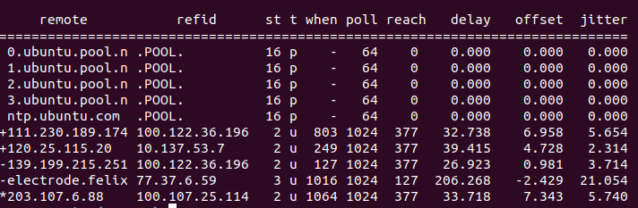

PlatON is a blockchain project that implements democratic governance. Validator nodes are jointly selected by all Energon holders to maintain the PlatON network. The 101 nodes with the most votes will become alternative validator, from which 25 validator nodes will be randomly selected using VRF to participate in managing the PlatON network.

 
This section describes how to operate as a validator node.

## Steps

The following steps must be completed in order

### synchronised time

Make sure the node's time is correct, so you need to synchronize with the time server in real time. Take the Ubuntu system as an example to explain how to synchronize time


#### Install NTP (Auto Sync)


Install ntp server and set it to boot automatically

```bash
sudo apt-get -y install ntp  &&  sudo systemctl enable ntp
```


#### View synchronization

Enter the following command 

```bash
ntpq -p
```

Output result


 
 
  

### Install node

The node server must be Ubuntu 18.04, please follow the part of Ubuntu in [Install Node](/en-us/Node/_[English]-Install-Node.md).


### Generate nodekey and blskey

When the node is started, the node's public and private keys and BLS public and private keys are required. The BLS public and private keys will be used in the consensus protocol.

Refer to [Node KeyPair](/en-us/Node/_[English]-WalletFile-and-KeyPair.md#Node-key) for the key generation method, and save the generated key to the directory where the node is located.

 
> [!NOTE|style:flat|label:Note]
>
> If the key is not generated in advance, the node is automatically generated in the node's data directory at startup.


### Start nodes to join the network

According to your needs, start the node to join the public network or set up the private network. Refer to the following:

- [Join Private Network](/en-us/Network/[English]-SettingUp-Private-Chain.md)
- [Join the Public Network](/en-us/Network/[English]-MainNet-and-TestNet.md)


### Configure nginx


For security reasons, it is not recommended to open the rpc port of the node directly. Nginx is recommended for reverse proxy, and strengthen the security of the Nginx port through user authentication and HTTPS. If you modified the node data directory, the nginx_conf.sh script also needs to be changed to the same node data directory. Nginx configuration steps are as follows:


**step1.** Download nginx_conf.sh

 
``` bash
wget https://7w6qnuo9se.s3.eu-central-1.amazonaws.com/opensource/scripts/nginx_conf.sh
```

or

``` bash
wget http://47.91.153.183/opensource/scripts/nginx_conf.sh
```

**step2.** Execute script

``` bash
chmod +x nginx_conf.sh && ./nginx_conf.sh
```


> [!NOTE|style:flat|label:Note]
>
> - When prompted for [sudo] password for`, enter the current account password.
> - When you are prompted for `Enter your name:`, enter your username.
> - when you are prompted for `Enter your password:`, enter your password. Be sure to remember the user name and password, this will be needed later in the configuration of MTool.
> - When the prompt `ngnix conf succeed` is displayed, it means that nginx is successfully configured. If the configuration is not successful, please contact us.


### Configure MTool

PlatON provides MTool for node staking , delegate and governance related operations.

MTool provides two signature methods for transactions: online signature and offline signature.

#### Online MTool

  Follow the procedure below to install online MTool:
- [Install MTool](/en-us/Tool/[English]-Online-MTool-user-manual.md#Install-Online-MTool)
- [Configure MTool](/en-us/Tool/[English]-Online-MTool-user-manual.md#Configure-Online-MTool)
- [Create Wallet](/en-us/Tool/[English]-Online-MTool-user-manual.md#Create-Wallet)
- [Configure validator node information](/en-us/Tool/[English]-Online-MTool-user-manual.md#Configure-verification-node-information)
- [Initiate pledge operation](/en-us/Tool/[English]-Online-MTool-user-manual.md#Initiate-a-pledge-operation)

#### Offline MTool

  Follow the procedure below to install offline MTool:
- [Install MTool](/en-us/Tool/[English]-Offline-MTool-user-manual.md#Install-MTool)
- [Configure MTool](/en-us/Tool/[English]-Offline-MTool-user-manual.md#Configuration)
- [Wallet Configuration](/en-us/Tool/[English]-Offline-MTool-user-manual.md#Wallet-configuration)
- [Connect to validator node](/en-us/Tool/[English]-Offline-MTool-user-manual.md#Connect-to-validation-node)
- [Initiate pledge operation](/en-us/Tool/[English]-Offline-MTool-user-manual.md#Initiate-a-pledge-operation)


> [!NOTE|style:flat|label:Note]
>
> The offline transaction signature must be completed offline. For the operation process, refer to [Offline MTool User Manual](/en-us/Tool/[English]-Offline-MTool-user-manual.md#Basic-operation-flow)
> For capable developers, you can develop your own node tools based on the Java SDK and Javascript SDK. Please refer to the documentation for SDK.
> - [Java-SDK](en-us/Development/[English]-Java-SDK.md)
> - [JavaScript-API](en-us/Development/[English]-JS-SDK.md)


## Validator node confirmation


After completing the staking operation, you can click the validator node list at the top of the homepage on the PlatON official blockchain browser [PlatScan](https://platscan.test.platon.network) to view all validator nodes.


