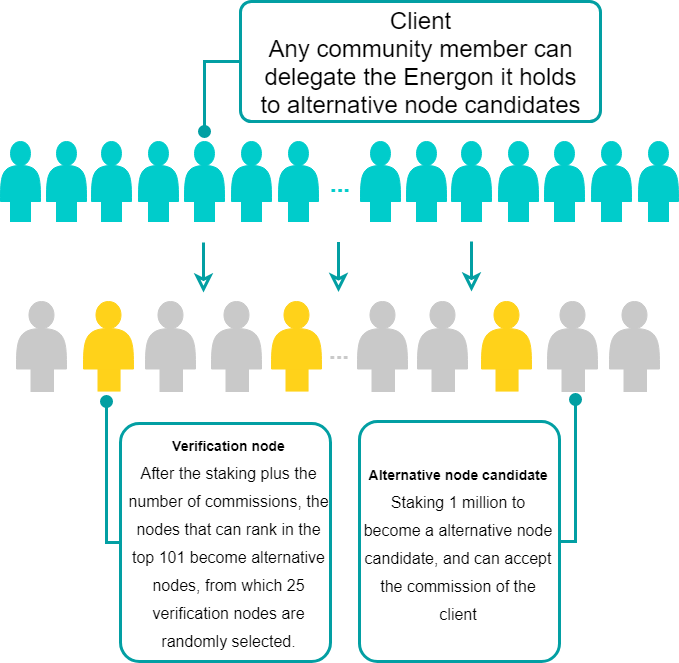
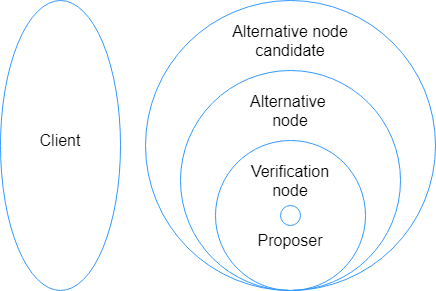
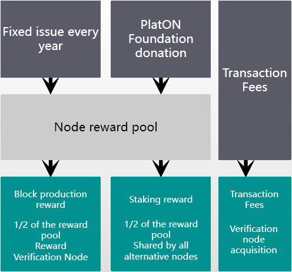

PlatON is a blockchain project that implements democratic governance. Verification nodes are jointly selected by all Energon holders to maintain and develop the PlatON network. The 101 nodes with the most votes will become candidate nodes, from which 25 verification nodes will be randomly selected using the VRF algorithm to participate in managing the entire PlatON network. Validation node will be responsible：

- Maintaining PlatON nodes and networks
- Production and verification blocks
- Participate in proposal voting decisions

### Basic requirements for becoming a verification node

#### Minimum staking requirements

The minimum staking requirement is 1 million Energon. stakings can be increased, but all stakings can only be cancelled all at once.

#### Hardware requirements

- Server: The server running the PlatON software and the backup server (both need to have a firewall)
- Memory: 8GB RAM
- Local storage: 512GB SSD, support dynamic expansion, single volume capacity up to 16TB
- Processor: 64-bit 4 cores (2.4 GHz or more per core)

#### Software requirements

It is recommended to use Ubuntu 18.04.

#### Network requirements

- Bandwidth: 100 Mbps
- The firewall must open the TCP two-way channel, if you need to discover other nodes, you need to open the UDP two-way channel

#### Operational requirements

- Network monitoring and real-time support
- 99.9% uptime
- Cross-region failover and data backup
- Security measures
- Support software upgrade

### How to become a verification node

- Alternative node candidate

  Energon holders who want to participate in the production of the PlatON block, staking to lock a certain number of Energon (minimum staking threshold is 1 million) into the staking contract and become candidate node candidates. The number of candidate node candidates is unlimited and can be delegate.

- Candidate node

  According to the total number of votes (the sum of their own staking amount and the number of entrusted by other clients), the candidate node ranked in the top 101 is called the candidate node. The candidate node participates in the verification node election of each consensus cycle and can get Staking. reward.

- Verification node

  Each consensus cycle (one round of 250 blocks), randomly selected 25 nodes among 101 candidate nodes as the consensus cycle verification node according to the weight of the total votes obtained.

- Proposer
  
  A consensus cycle produces 250 (25 verification nodes * each verification node produces 10 blocks in succession) blocks, 25 verification nodes take turns to become proposers, and each verification node has a block generation time of 20 seconds. 

- Delegate person

  Energon holders who are willing to delegate Energon to candidate nodes. Validation nodes cannot delegate each other or self-delegate.

The role relationship diagram is as follows. **For ease of description and understanding, alternative node candidates include candidate nodes and verification nodes. Candidate nodes include validation nodes.**

### How to participate in governance

How to participate in governanceIn PlatON, governance is implemented by voting on-chain proposals, which have the following types of proposals:

- Software upgrade proposal: used to initiate version upgrade voting on the chain to achieve the purpose of smooth upgrade.

- Parameter modification proposal: Used to modify the parameters that can be governed, such as system parameters.

- Cancel proposal: Used to cancel the software upgrade or parameter modification proposal that is being voted on the chain.

  

The basic process of proposal governance is as follows:

- After all draft proposals are submitted to the Github PIPs proposal repository in the form of a Pull Request, the GitHub proposal sponsor creates a proposal on the chain after full discussion in the community.
- All candidate nodes can participate in the proposal by voting on the chain, and each proposal can only vote once.
- For the upgrade proposal, the candidate node must initiate a voting transaction after upgrading the local node within the voting cycle.
- After the voting for the upgrade proposal is approved, the candidate nodes that have not been upgraded will be downgraded to alternative candidates and will no longer participate in consensus. The settlement cycle in which the downgrade is located will not receive Staking rewards.
- All candidate node candidates need to upgrade the local node and concurrently declare transactions in order to participate in the ranking and become candidate nodes.

### What rewards can I get

#### Reward pool

The reward pool consists of two parts:

- Additional issuance: 2.5% of the total amount of the previous year before the issuance, and 80% of the additional issuance (that is, 2% of the total amount) is entered into the reward pool
- Foundation donation: equivalent to 3.01% of the total initial allocation, distributed within the first 10 years, keeping the node reward pool unchanged every year

#### Node reward

Node rewards consist of three parts:

- Block reward: For each block that is successfully produced, the verification node will receive a fixed amount of Energon as a reward. 1/2 of the total node reward pool each year is used as a block reward. After the system completes a settlement cycle each time, the system will The number of block rewards and the remaining settlement cycles are used to recalculate the block rewards for each block in the next settlement cycle.
- Handling fees: All handling fees for packaging transactions are charged by the verification node of the packaging block.
- Staking reward: 1/2 of the total node reward pool is used as the Staking reward. Each time the system completes a settlement cycle, it will recalculate the Staking reward that should be issued in the next settlement cycle based on the annual remaining Staking rewards and the remaining settlement cycles. After the end of the cycle (10,750 blocks), it will be evenly distributed to all candidate nodes (including verification nodes)

#### Principal reward

  Staking rewards are automatically distributed to verification nodes and alternative nodes after the end of each settlement cycle. At the same time, the rewards assigned to the principals of each node will be automatically issued to the commissioned reward contract according to the sharing ratio set by each node.

#### Revenue and reward estimates

It is estimated that the Energon that can be staking in the first year of launch is 8,500,000,000. Assuming that the staking ratio is 40%, the average number of blocks per year is 15,759,500.

| Single node stakings number | Number of nodes | Staking ratio | Block reward | Staking reward | Total reward | Rate of return |
| ------------ | ------ | -------------- | ----------------- | -------------- | ------------ | ------------ |
| 40,000,000   | 10     | 1.18% | 1,551,572  | 1,298,098       | 2849670    | 7.12% |
| 35,000,000   | 50     | 1.04% | 1,357,626    | 1,298,098      | 2655724    | 7.59% |
| 30,000,000   | 41     | 0.89% | 1,163,679    | 1,298,098      | 2461777    | 8.21% |
| 20,000,000   | 1      | N/A | N/A            | N/A               | N/A            | N/A          |

(The transaction fee is not calculated here, the actual income is higher. The actual income will also vary with the staking and block production conditions)

- The first 10 years are guaranteed to be no less than 250 million annually for verification node incentives, of which 1/2 is used for block rewards and 1/2 is used for Staking reward
- Each consensus cycle, 25 nodes are randomly selected from the top 101 nodes to participate in consensus, and the number of production blocks is directly proportional to the number of votes obtained
- Staking rewards are evenly distributed to all candidate nodes
- Nodes after ranking 101 do not participate in consensus, cannot participate in block generation and receive block rewards, and cannot receive Staking rewards

### What actions will be punished

#### Way of punishment

There are two ways to punish in PlatON:

- Cancel verification node qualification: Forcibly unsecure the pledge and kick out the candidate node candidate ranks. Staking rewards are not allocated in the last settlement cycle. Energon pledged is returned to the original pledge account after 28 settlement cycles. Nodes cannot be re-pledged as candidate node candidates.
- Deducted pledged Energon: Directly deducted pledged Energon and put it into the reward pool for block production and Staking rewards in the second year.

#### Zero Production Block

After being selected as a verification node, within a consensus period, no block has been produced or all blocks produced have not been confirmed by other verification nodes.

The zero-block behavior is recognized and penalized by the verification node in the next consensus cycle, and the verification node is disqualified by the penalty method. At present, no pledge deposit is deducted (adjustment may be made before the mainnet goes live).

#### Double production or double sign

In the case of producing or signing multiple blocks at the same block height, in addition to canceling the verification node qualification, a 0.1% deduction is required (adjustment may be made before the mainnet is launched).

Reports of dual production or dual signing can be initiated by anyone, but not self-reported. After the current verification node verifies and reaches a consensus, the person being reported will be identified as a violation and punished. 50% of the penalty (may be adjusted before the mainnet is online) is given to the reporter, and 50% is placed in the reward pool for the next year's block production and Staking reward.

