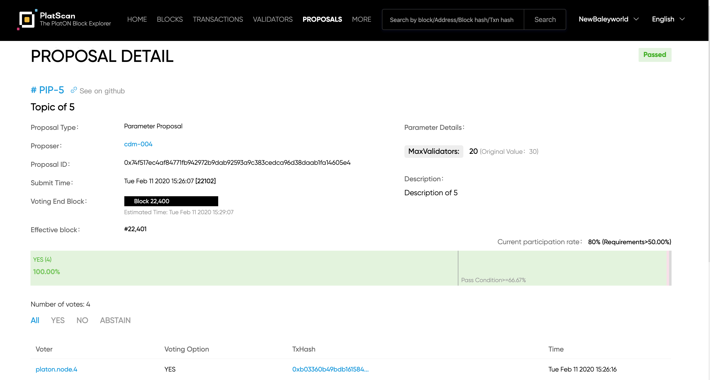

**[PlatScan](https://platscan.test.platon.network/)** is a Block Explorer and Analytics Platform for PlatON. It provides services for querying, browsing, and analyzing data on the PlatON Network blockchain ( Include testnet). You can query addresses, blocks, transactions, validators, governance proposals, and all other activities taking place on PlatON Network.

**Please note that PlatScan is not a wallet service provider. We do not store your private keys and we have no control over the transactions that take place over the PlatON Network.**

> [!NOTE|style:flat|label:Note]
>
> In order to have a better user experience, it is recommended that you use Google Chrome or a browser with IE11 or above to access it. Other browsers or lower versions of IE may encounter compatibility issues such as pages not being displayed, incomplete display, and unable to click.

In this section we will give an overall introduction to PlatScan:

## Navigation bar

PlatScan currently supports the NewBaleyword Rally test network, and will subsequently support the main network and other test networks. You can enter the block height, address, block hash, transaction hash, validator name in the search box to query the specific information you need to browse. You can also click the navigation menu-Home, Blocks, Transactions, Validators, and Proposals to view more information on the PlatON Network blockchain.

## Home

"Home" provides a quick query entry. Support input "block height" and "block hash" to query block information, input "transaction hash" to query transaction information, input "account address" to query account information, and input "validator name" to query validator information.

Showed the basic situation of PlatON Network, including the running status of the chain, transaction data, circulation circulating supply and stake information, block list, and validators currently participating in consensus. Lets you quickly learn about PlatON Network.

If you want to know more about PlatON Network, you can click "About PlatON" to enter PlatON Network's official website for more details.

ATON is PlatON Network's mobile wallet client, allowing you to store and transfer PlatON Network's tokens, and participate in the PlatON Network's Staking economy to earn revenue. 

At the bottom of the page, the official community website of PlatON Network is provided. Welcome your visit and attention.

 

## Blocks

Blocks, showing a list of all blocks that have been produced. From the list, you can learn about the block production nodes, the number of transactions included in the block, and the block production reward. You can click the blue link to view the corresponding block details and node details.

In the block details, you can view the block information of the current block and the transaction information contained in the block.

 

## Transactions

Transaction, showing all transaction information written into the blockchain. From the list, you can know the block where the transaction is located, the operation address to execute the transaction, the type of transaction, and transaction costs. You can click the blue link to view the corresponding transaction details, block details, and address details.

Transaction details, showing detailed transaction content and basic transaction information of different transaction types.

 

## Account address details

You can enter it by querying the account address or the related account address link.

In the address details, you can understand the basic information of the account address, including the balance of the account address, the number of transactions associated with the address, the amount of stakes/ delegations, unclaimed reward and Invalid delegations(The amount of delegations in an invalid state. The delegations will not generate delegated rewards, and requires your active withdrawal).

If the current account address is participating in the restricted token program, the restricted balance is displayed. Click Restricted Balances to see detailed restricted balance information:

In the account address details, you can also browse in detail all the associated transaction information, delegated information, and details of delegated rewards that have been received for the account address.

**Transactions,** support browsing and downloading transaction information according to transaction classification. You can click on the blue link of the transaction hash to view detailed transaction information. Note that downloading transaction information requires Google security verification. You can download up to 30,000 pieces of data each time.

**Delegations**, you can view the current account address delegation statistics, including the total delegated amount, the number of validators that have been delegated, the number of delegated locks, and the number of unlocked delegates. At the same time, based on the delegated nodes, the delegation information of each node is shown in detail, including: the delegated nodes, the number of delegates (locked + unlocked delegates), and the locked delegates (the amount of delegated accounts whose accounts are locked under the node , Locked delegations can get delegated rewards), the number of unlocked delegations, the number of delegations to be redeemed, and the number of delegation rewards to be received.

**Reward Details**, based on the transaction history of delegated reward collection, shows the details of delegated reward collection in detail, so you can clearly understand the source of delegated reward.

## Contract details

You can enter it by querying the contract address or the related contract address link.

In the contract details, you can understand the basic information of the contract, including the contract balance, the number of transactions associated with the contract, the contract name, and the contract creation information.

You can also browse the contract-related transaction information in detail, as well as the contract type and the on-chain bytecode of the contract. We will continue to optimize it in the future to provide more data and analysis information. 

### Validators

The validator shows the nodes currently maintaining the operation of the PlatON Network, participating in consensus verification, and the current staking and reward situation. You can learn the current stake activity, reward situation, and progress of the current settlement epoch through real-time stake information, reward information for this epoch, and the next settlement epoch.

>  Note: Block Reward - refers to the reward for block production for each block produced by the participating nodes in the current settlement epoch. Staking Reward - refers to the staking reward that each active node in the settlement block of the current settlement epoch will get. Each interval of 10750 blocks is a settlement epoch.

The validator list shows all the nodes currently participating in the PlatON Network network. You can query the validators you need to find by entering the validator name, and you can browse the list of nodes in different states by filtering.

From the list, you can intuitively understand the status of each validator, the stake and delegtate data, the number of delegators, the stability of the node (including the number of low block generation times, the number of double signings), the number of blocks generated, and the estimated validator annualized yield , And the estimated delegated annualized yield.

**Validator Details**, enter by clicking the validator name link in the validator list. In the details of the validator, you can view detailed validator statistics, node information, block list, node action records, delegate records, reward details, and so on.

**Node Information**, shows the basic node information submitted by this verification node. Including node ID (same node public key), operation address (that is, the node's staked account address), reward account (that is, the validator receives the reward account address), node official website, identity authentication ID (keybase public key, click Can enter user keybase personal homepage), node description information.

**Produced Blocks**, showing the list of blocks produced by the validator.

**Validator Actions**, showing all active or performed behavior records of the validator. Contains records of node information changes, proposal voting, and penalties.

**Delegations** ,shows the delegation information received by this validator.

**Reward Details**, showing the delegated reward claim records received from this validator.

  

## Governance proposal

Governance proposals, showing all submitted proposals.

Proposal list contains: PIP number (PIP number assigned by GitHub proposal library, click to enter the proposal details in GitHub), title (proposal title of the proposal in GitHub, click to enter the proposal details displayed in PlatScan), proposal type (including: upgrade Proposal, Cancel Proposal, Text Proposal, Parameter Proposal), Status, Voting End Block (Voting Progress), Proposal Time.

Click on the blue link in the proposal title to go to the proposal details. In the proposal details, you can view the basic information, voting information and voting records of the proposal. Different proposal types show slightly different basic information about the proposal.

For example, the parameter proposal:

## Governance Parameter

Click "More" on the navigation bar menu, and select “ Governance Parameter” from the drop-down list. You can view the current governance parameters of the PlatON network and the current and Genesis values of the governance parameters.

>  Note: You can modify the parameter value by submitting the parameter proposal. Note that when the module name and parameter name at the top of the browser are actually submitted, the first letter is lowercase.

