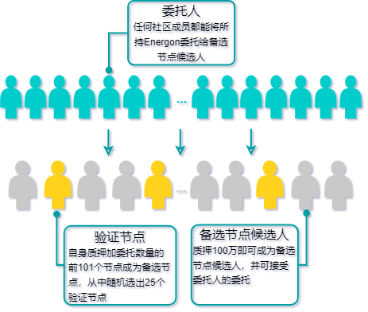
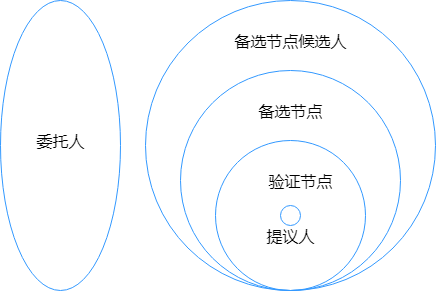
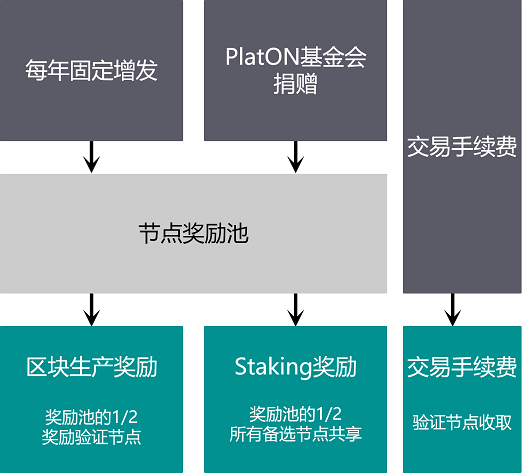

PlatON是实行民主治理的区块链项目，验证节点由所有Energon持有者共同推选，以维护和发展 PlatON网络。得票数最多的101名节点将成为备选节点，从中用VRF算法随机选出25个验证节点，参与管理整个PlatON网络。验证节点将负责：

- 维护 PlatON节点和网络
- 生产和验证区块
- 参与提案投票决策

### 成为验证节点的基本要求

#### 最低质押要求

最低质押要求为100万Energon，可以增加质押，但是只能一次性全部取消所有质押。

#### 硬件要求

- 服务器: 运行PlatON软件的服务器和备份服务器(都需要具备防火墙)
- 内存: 8GB RAM 
- 本地存储: 512GB SSD, 支持动态扩容，单卷容量上限16TB
- 处理器: 64位4 核 (每核2.4 GHz以上)
- 带宽: 100 Mbps

#### 软件要求

建议使用Ubuntu 18.04。

#### 运营要求

- 网络监控及实时支持
- 99.9%的正常运行时间
- 跨地域失效备援和数据备份
- 安全保障措施
- 支持软件升级

### 如何成为验证节点

- 备选节点候选人

  想参与PlatON区块生产的Energon持有者，质押锁定一定数量（最低质押门槛为100万）的Energon到质押合约内，成为备选节点候选人，备选节点候选人数量不限，可接受委托。

- 备选节点

  根据总得票数（自己的质押数量和其他委托人的委托数量之和）排名在前101名的备选节点候选人称为备选节点，备选节点参与每个共识周期的验证节点选举，可获得Staking奖励。

- 验证节点

  每个共识周期（250个区块一轮），按总得票数权重随机在101个备选节点中随机选出25个节点作为共识周期验证节点。

- 提议人
  
一个共识周期生产250（25个验证节点 * 每个验证节点连续出10块）个区块，25个验证节点轮流成为提议人，每个验证节点的出块时间为20秒。  
  
- 委托人

  把自己的Energon委托给备选节点候选人的Energon持有者。验证节点不能相互委托，也不能自委托。

角色关系示意图如下，**为方便描述和理解，备选节点候选人包含备选节点和验证节点。备选节点包含验证节点。**

### 如何参与治理

PlatON中，通过链上提案投票的方式进行治理，有以下几类提案：

- 软件升级提案：用来在链上发起版本升级投票，达到平滑升级的目的。

- 参数修改提案：用来对系统参数等可治理的参数进行修改。

- 取消提案： 用来取消链上正在投票中的软件升级或参数修改提案。

  

提案治理基本流程如下：

- 所有提案草稿以Pull Request形式提交到Github PIPs提案仓库后，经过社区充分讨论后由GitHub提案发起人在链上创建提案。
- 所有备选节点可以通过链上投票参与提案，每个提案只能投一次票。
- 对于升级提案，备选节点必须在投票周期内升级本地节点后发起投票交易。
- 升级提案投票通过后，未升级的备选节点将降级为备选节点候选人，不再参与共识，降级所处的结算周期不能获得Staking奖励。
- 所有备选节点候选人需要升级本地节点并发版本声明交易，才能参与排名成为备选节点。

### 能获得哪些奖励

#### 奖励池

奖励池由两部分组成：

- 增发：每年增发前一年总量的2.5%，增发部分的80%（即总量的2%）进入奖励池
- 基金会捐赠：相当于初始分配总量的3.01%，在前10年内分配，保持节点奖励池每年不变

#### 节点奖励

节点奖励由三部分组成：

- 区块奖励: 每成功产出一个区块，验证节点将获得定额Energon作为奖励. 每年节点奖励池总量的1/2作为区块奖励，系统每完成一个结算周期，将根据年度剩余出块奖励数和剩余结算周期数重新计算下个结算周期中每个区块的出块奖励。
- 手续费: 打包交易的手续费全部由打包区块的验证节点收取。
- Staking奖励: 节点奖励池总量的1/2作为Staking奖励，系统每完成一个结算周期，将根据年度剩余Staking奖励数和剩余结算周期数重新计算下个结算周期应该发放的Staking奖励，每个Staking周期（10,750区块）结束后，平均发放给所有备选节点（含验证节点）

#### 委托人奖励

  Staking奖励发放给验证节点和备选节点，由验证节点和备选节点自行分配给相关委托人。

#### 收益及奖励预估

预计上线首年可Staking的Energon为8,500,000,000，假设Staking比例40%，平均每年的区块数为15,759,500，举个例子：

| 单节点质押数 | 节点数 | 质押比例 | 区块奖励 | Staking奖励 | 奖励总额 | 收益率 |
| ------------ | ------ | -------------- | ----------------- | -------------- | ------------ | ------------ |
| 40,000,000   | 10     | 1.18% | 1,551,572  | 1,298,098       | 2849670    | 7.12% |
| 35,000,000   | 50     | 1.04% | 1,357,626    | 1,298,098      | 2655724    | 7.59% |
| 30,000,000   | 41     | 0.89% | 1,163,679    | 1,298,098      | 2461777    | 8.21% |
| 20,000,000   | 1      | N/A | N/A            | N/A               | N/A            | N/A          |

(此处没有计算交易手续费，实际收益更高。实际收益也会随质押情况和出块情况变动)

- 前10年每年保证不低于2.5亿用于验证节点激励，其中1/2用于区块奖励，1/2用于Staking奖励
- 每个共识周期，从排名前101个节点随机选取25个节点参与共识，生产区块的数量跟得票数成正比
- Staking奖励平均分给所有备选节点
- 排名101之后的节点不参与共识，不能参与出块并获得区块奖励，也不能获得Staking奖励

### 哪些行为会被处罚

#### 处罚方式

PlatON中有两种处罚方式：

- 取消验证节点资格：强行解质押，并踢出备选节点候选人行列，最后一个结算周期也不分配Staking奖励，所质押的Energon在28个结算周期后退回原质押账户，在质押金冻结期间，节点不能重新质押成为备选节点候选人。
- 扣除质押Energon：直接扣除质押Energon，置入奖励池用于第二年的出块和Staking奖励。

#### 零出块

被选为验证节点后，在一个共识周期内，没有生产任何区块或生产的所有区块都没有被其他验证节点确认，则认定为零出块。

零出块行为由下一个共识周期的验证节点通过共识认定并加以处罚，处罚方式取消验证节点资格，目前不扣除质押金（主网上线前可能会进行调整）。

#### 双出或双签

在相同的区块高度生产或签名多个区块，除取消验证节点资格外，还需要扣除0.1%（主网上线前可能会进行调整）质押Energon作为处罚金。

双出或双签行为可以由任何人发起举报，但是不能自举报。当前验证节点验证并达成共识后，被举报人将被认定为违规行为并加以处罚。处罚金的50%（主网上线前可能会进行调整）给与举报人，50%置入奖励池用于第二年的出块和Staking奖励。

