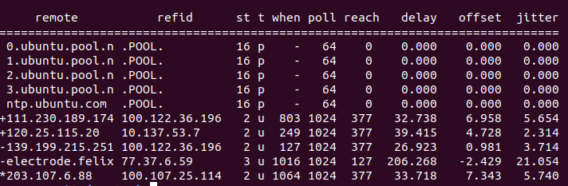

# 时钟同步

验证节点的时间需要保持正确，因此需要和时间服务器实时同步，以Ubuntu系统为例，说明如何进行时间同步:

## 安装NTP(自动同步)

安装ntp，并且设置开机自启
```bash
apt-get -y install ntp  &&  systemctl enable ntp
```

## 查看同步情况
输入以下命令查看同步情况
```bash
ntpq -p
```
返回



属性说明：

- remote – 用于同步的远程节点或服务器

- refid – 远程的服务器进行同步的更高一级服务器

- st – 远程节点或服务器的 Stratum（级别，NTP 时间同步是分层的）

- t  类型 u: unicast（单播） 或 manycast（选播） 客户端, b: broadcast（广播） 或 multicast（多播） 客户端, l: 本地时钟, s: 对称节点（用于备份）, A: 选播服务器, B: 广播服务器, M: 多播服务器,

- when 距离上次请求时间（秒）

- poll   本机和远程服务器多长时间进行一次同步（秒）

- reach  用来测试能否和服务器连接，每成功连接一次它的值就会增加，

- offset  主机与远程节点或服务器时间源的时间偏移量，offset 越接近于0，主机和 NTP 服务器的时间越接近（毫秒）

- delay – 从本地到远程节点或服务器通信的往返时间（毫秒）


remote前面符号的说明:

（ + ）良好的且优先使用的远程节点或服务器（包含在组合算法中）
  ( * ）当前作为优先主同步对象的远程节点或服务器


