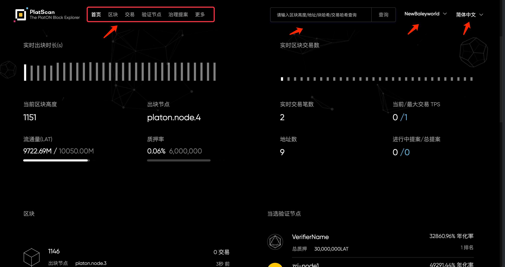
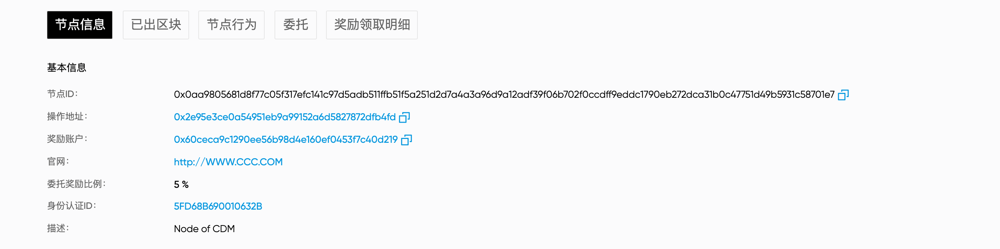
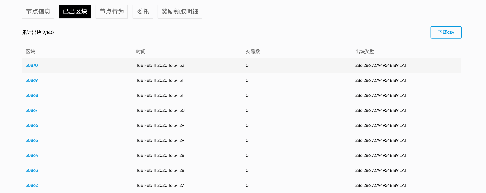
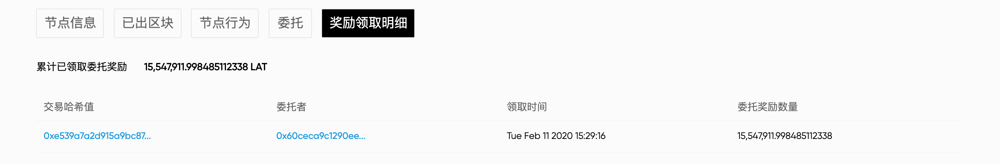
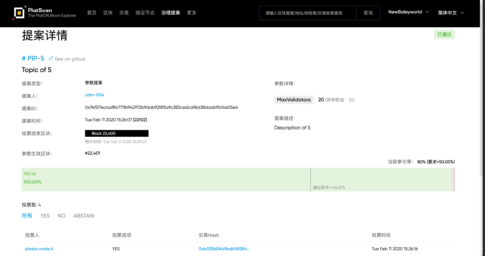

# **区块链浏览器-PlatScan**

***[PlatScan](https://platscan.platon.network/)***是PlatON Network区块链资源管理与分析平台，提供了PlatON Network区块链（及其测试网）数据查询、浏览、分析的服务，您可以查询地址，区块，交易，验证节点，治理提案的信息以及在PlatON Network上进行的其他活动。

**请注意，PlatScan不是钱包服务提供商。我们不会存储您的私钥，也无法控制PlatON Network上发生的交易。**

*为了您有更好的使用体验，建议您请使用谷歌浏览器或IE11版本以上浏览器进行访问，其他浏览器或低版本IE会出现页面不显示、显示不全、无法点击等兼容性问题。*

在本节中，我们将全面介绍PlatScan：

## 导航栏

PlatScan当前支持NewBaleyword拉力赛活动网络，后续将支持主网及其他测试网。 您可以在搜索框内输入区块高度/地址/区块hash/交易hash/节点名称查询具体需要浏览的信息。也可以点击导航菜单-首页/区块/交易/验证节点/治理提案浏览PlatON Network区块链更多信息。

## 首页

首页提供了快速查询入口。支持输入“区块高度”、“区块hash” 查询区块信息，输入“交易hash”查询交易信息，输入“账户地址”查询账户信息，以及输入“节点名称”查询节点信息。

同时展示了PlatON Network的基本情况，包括链的运行状态，交易数据，流通及质押信息，区块列表，当前参与共识的验证节点等。方便您快速了解PlatON Network。

如果您想了解更多PlatON Network信息，您可以点击“关于PlatON”，进入PlatON Network官网查看了解更多详细信息。

ATON是PlatON Network的移动钱包客户端，允许您存储和转移PlatON Network的Token，并参与到PlatON Network的Staking经济当中来获取收益。点击“ATON下载”进行下载。

在页面底部，提供了PlatON Network官方社区网站，欢迎您的访问和关注。

 

## 区块

区块，展示所有已生产，的区块列表。从列表中可以了解区块的出块节点，区块包含的交易数，区块的出块奖励等。您可以点击蓝色链接查看对应的区块详细信息，出块节点详细信息。

在区块详情内，可以查看到当前区块的区块信息以及区块中包含的交易信息。

 

## 交易

交易，展示所有已写入区块链的交易信息。从列表中可以了解交易的所在区块，执行交易的操作地址，交易类型，交易费用等。您可以点击蓝色链接查看对应的交易详细信息，区块详细信息以及地址详细信息。

在交易详情，可以查看到不同交易类型的详细交易内容及基础的交易信息。

## 账户地址详情

您可以通过查询账户地址或者相关账户地址链接进入。

在地址详情中，您可以了解账户地址的基本信息，包含账户地址的余额，地址关联的交易数、质押/委托量、待领取委托奖励，待赎回委托量（指节点退出，委托关系解除，处于无效状态的委托量。该委托不会产生委托奖励，需要您主动赎回）。

 

如果当前账户地址有参与锁仓，则在余额处展示锁仓余额，点击锁仓余额可查看详细的锁仓信息：

在账户地址详情中，您还可以详细的浏览账户地址所有关联的交易信息、委托信息以及已领取的委托奖励明细信息。

**交易信息**，支持根据交易分类进行浏览和交易信息下载。您可以点击交易hash的蓝色链接查看详细的交易信息。注意交易信息下载需要进行Google安全验证，每次最多可下载最近的3万条数据。

**委托信息**，您可以查看到当前账户地址委托统计信息，包含总计委托量，已委托的验证节点数，委托已锁定数量，委托未锁定的数量。同时基于已委托节点，详细展示了各节点的委托信息，包含：委托的节点，已委托数量（锁定+未锁定的委托数量）、已锁定委托（该账户地址在该节点下已锁定的委托量，锁定的委托可获得委托奖励）、未锁定委托数量、待赎回的委托数量，以及待领取委托奖励数量。

 **奖励明细**，基于委托奖励领取交易记录，详细的展示了委托奖励领取的明细，方便您清晰的了解委托奖励来源。

 

 

## 合约详情信息

您可以通过查询合约地址或者相关合约地址链接进入。

在合约详情中，您可以了解合约的基本信息，包含合约的余额，合约关联的交易数、合约名称和合约创建信息。

您还可以详细的浏览合约关联的交易信息以及合约类型与合约上链字节码，后续我们将不断优化，提供更多数据和分析信息。

## 验证节点

验证节点显示了当前维护PlatON Network网络运行、参与共识验证的节点，以及当前Staking与奖励情况。您可以通过实时质押信息、本周期奖励信息、下个结算周期，了解当前质押活跃情况、奖励情况、以及当前结算周期进展情况。

*注：出块奖励是指当前结算周期，参与出块的节点每生产一个区块可获得的出块奖励。质押奖励是指当前结算周期的结算区块每个活跃中状态的节点将可以获得的质押奖励。每间隔10750个区块为一个结算周期。*

验证节点列表，展示了当前所有参与到PlatON Network网络的节点。您可以通过输入节点名称查询您需要查找的节点，同时可以通过筛选，浏览不同状态下的节点列表。

从列表中您可以直观的了解各节点的状态，质押委托数据，委托者数、节点的稳定性（包含低出块率次数、双签次数）、已产生区块数、预计节点年化收益率、以及预计委托的年化收益率。

**验证节点详情**，通过点击验证节点列表中节点名称链接进入。在验证节点详情里，您可以查看到节点详细的指标统计信息，节点信息，已出块列表，节点的行为记录，委托记录，奖励领取明细等。

 

**节点信息**，展示了该验证节点提交的节点基本信息。包括节点ID（同节点公钥）、操作地址（即节点质押的账户地址）、奖励账户（即验证节点接收奖励的账户地址），节点官网、身份认证ID（keybase网站64位的公钥，点击可进入用户keybase个人主页）、节点描述信息。

**已出区块**，展示了验证节点所出区块列表。

 

**节点行为**，展示了验证节点的所有主动或被进行的行为记录。包含节点信息变更，提案投票，被处罚等记录。

 **委托**，展示了该节点接收到的委托信息。

 **奖励领取明细**，展示了从该节点领取到的委托奖励领取信息。

 

## 治理提案

治理提案显示了当前PlatON Network网络所有提交的提案信息，您可以在这里详细的了解提案相关的提案内容，投票进度，提案状态等信息。列表中展示了PIP编号（GitHub提案库分配的PIP编号，点击进入GitHub中的该提案详情）、提案标题（点击进入PlatScan展示的提案详情）、提案类型（包含：升级提案、取消提案、文本提案、参数提案）、状态、投票结束区块（投票进度）等。

点击提案标题的蓝色链接进入到提案详情。在提案详情中，您可以查看提案的基本信息，投票信息以及投票记录。不同的提案类型，展示的提案基本信息稍微有些差异。

例如，参数提案：

### **可治理参数**

点击导航栏菜单更多，下拉选择“可治理参数”，可以查看到当前PlatON network支持治理的m参数，以及对应可治理参数的当前值与初始值。

*注：您可以通过提交参数提案修改参数值，注意浏览器上方的模块名和参数名实际提交时，首字母小写。*

