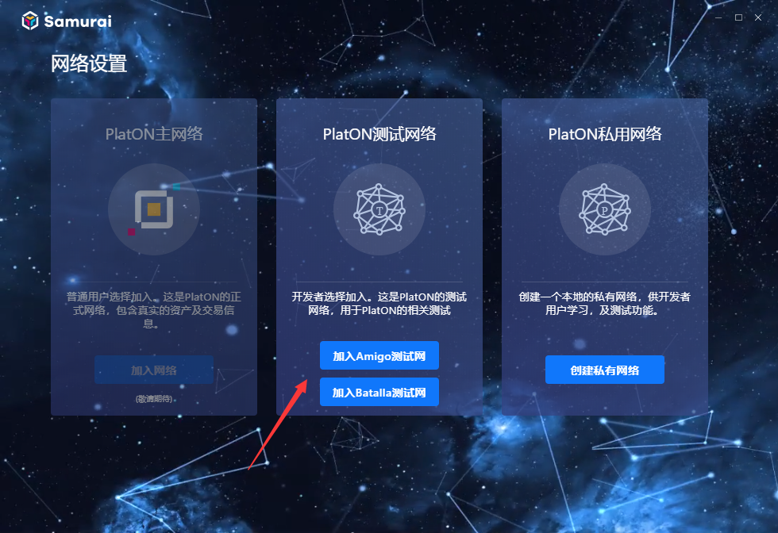
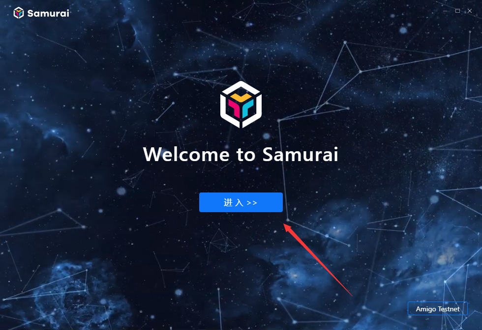
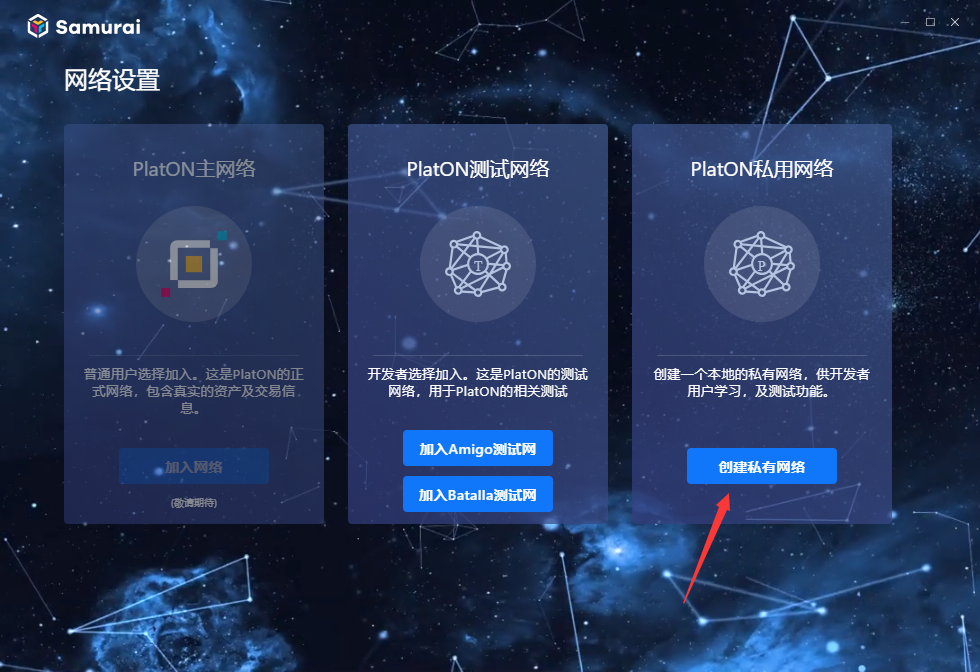
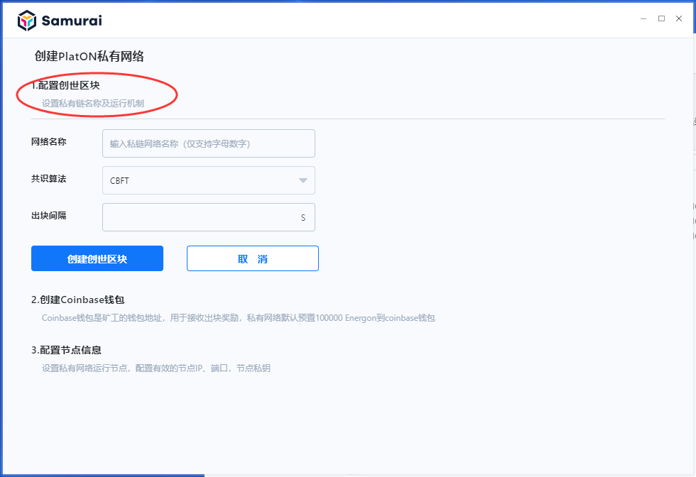
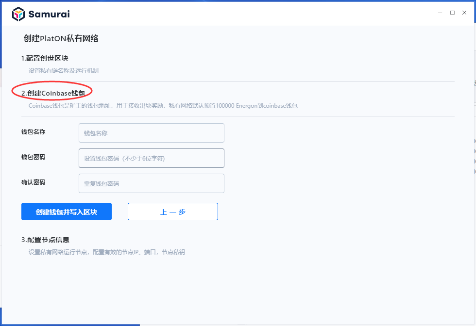
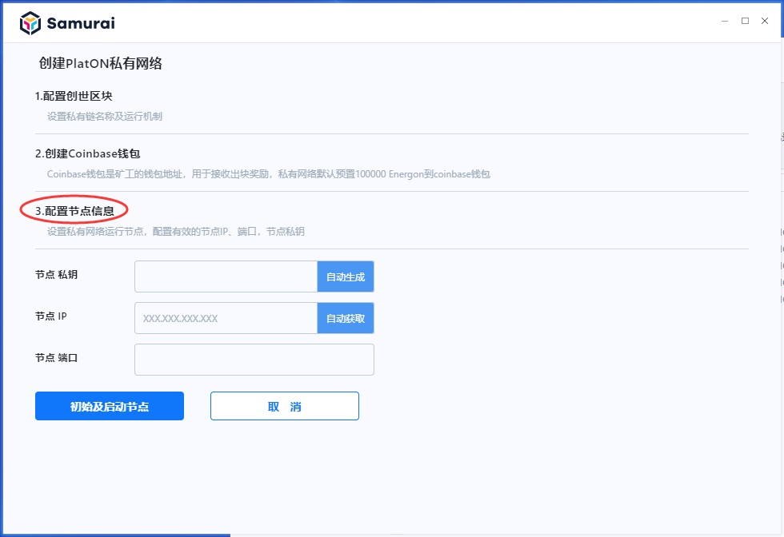
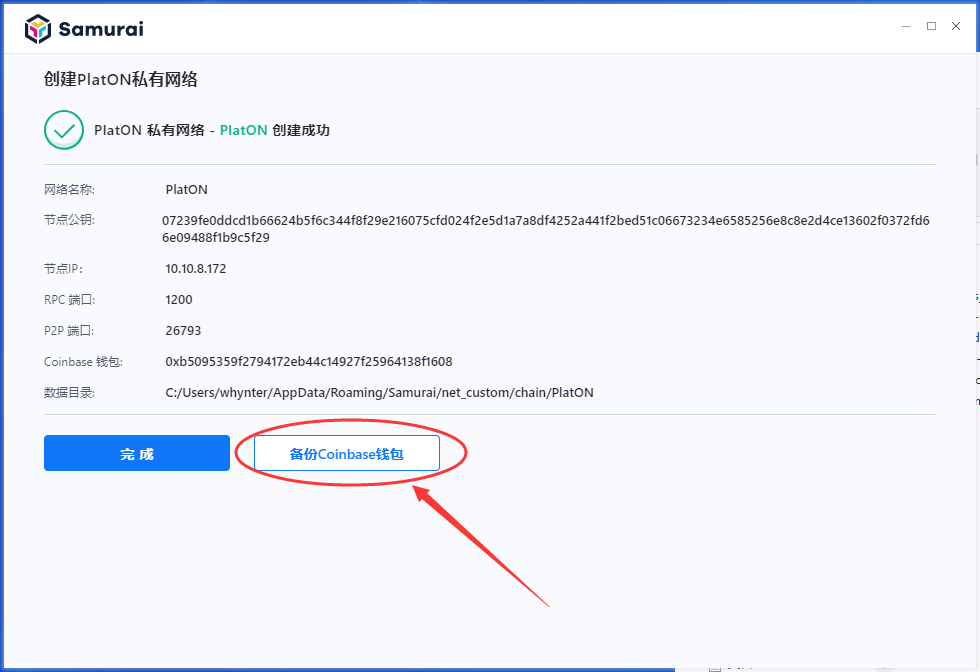

# PlatON网络初始化

## 如何加入PlatON测试网络

1.初次启动客户端时，客户端自动进入“网络设置”界面，选择“加入某个测试网络”，系统会自动启动该测试网络节点进程，连接测试网络，同步区块交易数据。

*温馨提示：*

*Amigo测试网络为官方自主运营的测试网络，网络稳定，性能较好，推荐使用（不支持其他共识节点加入）；*

*Batalla测试网络为开放的合作运营的测试网络，允许有条件的共识节点加入，网络稳定可能无法保证。*

2.进入“Welcome to Samurai”界面，点击【进入】，完成操作。

## 如何创建PlatON本地私有网络

### 创建私有网络

1.初次启动客户端时，客户端自动进入“网络配置”界面，点击“创建私有网络” ，如下图所示：

2.配置创世区块信息（出块间隔建议在1-10s内），完成各个字段配置后，点击【创建创世区块】，如下图所示：

3.创建Coinbace钱包，完成各个字段配置后，点击【创建钱包并写入区块】，如下图所示：

4.配置节点信息，完成各个字段配置后，点击【初始化并启动节点】，如下图所示：

5.私用网络创建完成后，建议您点击【备份钱包】，将Coinbace钱包备份到安全的地方。

**提示：**

*想了解如何获取节点私钥、IP、端口，请点击[这里](/zh-cn/basics/[Chinese-Simplified]-%e7%a7%81%e6%9c%89%e7%bd%91%e7%bb%9c.md)。*

